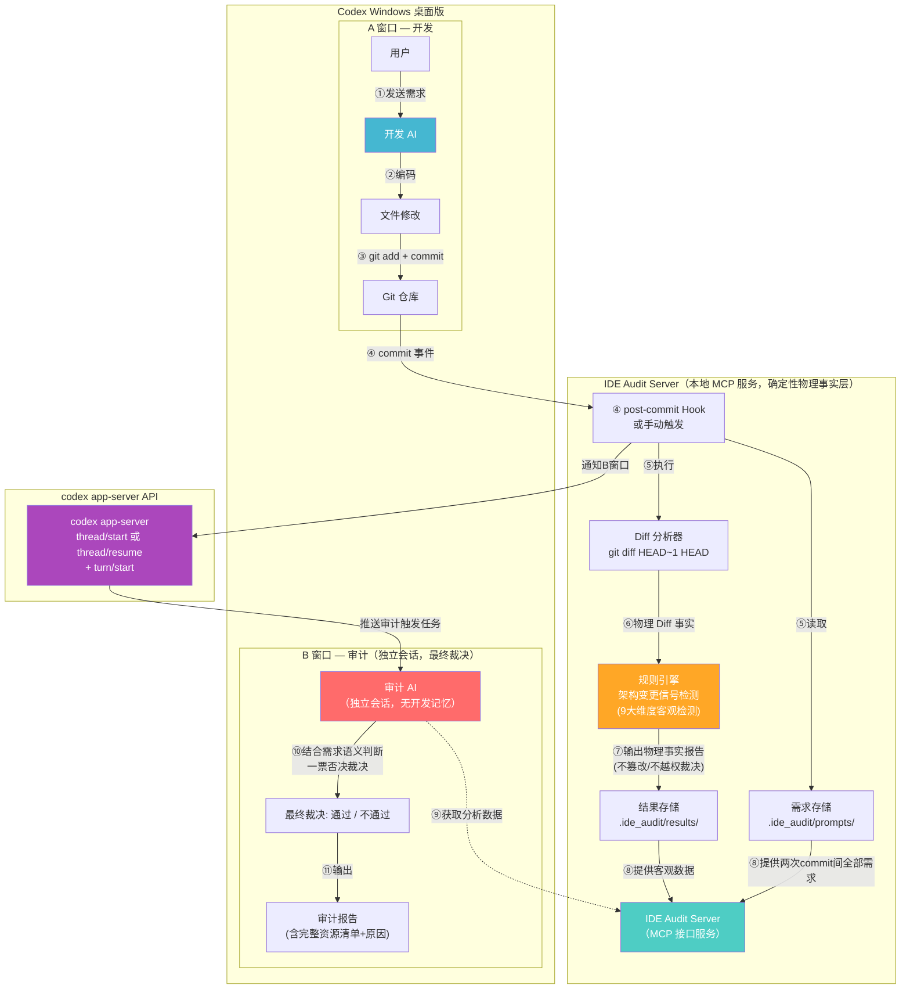
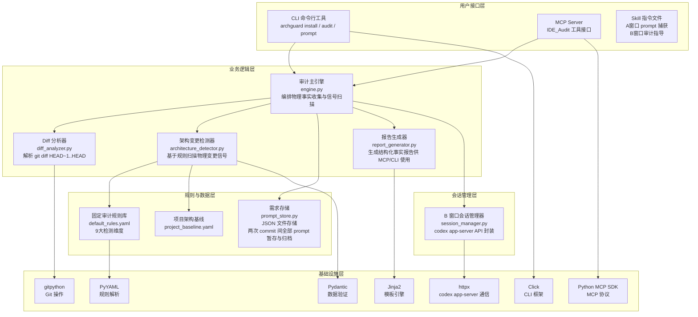

# IDE_Audit — AI IDE 架构审计插件 产品设计文档

> **产品名称**：IDE_Audit
> **设计目标**：构建一个独立于 AI IDE 的旁路审计系统，在 AI IDE 完成每轮开发后，通过**用户原始需求 + git diff** 自动判断变更是否合理，防止 AI 自作主张地修改架构、合并/拆分模块，导致"修一个 bug 却退化另一个功能"的长期项目健康损害。
> **版本**：v1.1（设计版）
> **更新时间**：2026-09-03

---

## 一、项目信息

| 项目 | 值 |
|:---|:---|
| 产品名称 | IDE_Audit |
| 项目类型 | 独立开源项目 |
| 仓库地址 | https://github.com/lndlwh2024/AI_IDE_Audit |
| 工作目录 | H:\AIcode\Antigravity\AI_IDE_Audit |
| 首个适配 | **Codex Windows 桌面版**（ChatGPT desktop app，Powered by Codex & OWL） |
| 包管理 | pip + pyproject.toml |
| 开源协议 | MIT |

---

## 二、核心架构：同一 AI IDE，双窗口分离审计

### 2.1 设计原理

```
┌────────────────────────────────────────────────────────────────────────┐
│                   Codex Windows 桌面版（同一个 AI IDE）                   │
│                                                                        │
│   ┌──────────────────────────┐          ┌──────────────────────────┐   │
│   │       A 窗口（开发）       │          │       B 窗口（审计）       │   │
│   │                          │          │                          │   │
│   │  · 用户正常交互开发       │          │  · 独立审计员视角        │   │
│   │  · 保留完整开发对话上下文 │          │  · 无 A 窗口开发推导记忆 │   │
│   │  · 响应指令并 commit 代码 │          │  · 只接收客观事实与需求  │   │
│   └─────────────┬────────────┘          └─────────────▲────────────┘   │
│                 │                                     │                │
│                 │      跨会话完全隔离（防止自我辩护）     │                │
│                 └───────────────── ╳ ─────────────────┘                │
│                                                                        │
│       共用同一个 LLM（无需额外配置 API Key）                              │
│       B 窗口通过 codex app-server API 自动拉起/复用                       │
└────────────────────────────────────────────────────────────────────────┘
```

### 2.2 核心原则

1. **物理隔离**：A 窗口和 B 窗口是完全独立的会话，不共享上下文
2. **信息最小化**：B 窗口只接收事实数据（需求 + diff），不接收开发 AI 的解释或理由
3. **规则引擎前置**：架构变更检测由确定性代码完成，LLM 无法"绕过"
4. **对抗性 Prompt**：B 窗口的初始 prompt 以"独立审计员"身份定义
5. **LLM 无缝继承**：使用 AI IDE 自带的 LLM，用户无需配置任何 API Key
6. **完整需求上下文**：捕获两次 commit 之间的**所有**用户提示词，而非仅最后一条

### 2.3 核心组件关系图解（插件、Skill、MCP、Git Hook）

整个系统由四个核心概念紧密协同，各司其职：

| 组件名称 | 表现形式 | 核心职责 | 本架构中的具体动作 |
|:---|:---|:---|:---|
| **IDE_Audit（插件产品）** | Python 包与 CLI 命令行工具（`archguard`） | **总控中枢** | 统一管理安装流程、规则引擎、文件关联算法、报告生成与会话生命周期。 |
| **Skill（行为规范）** | 注入到 `AGENTS.md` 的 Agent 指令规则 | **AI 员工守则** | 约束 A 窗口行为：收到需求必须记录 prompt；改完代码**必须自动执行 `git commit`**。 |
| **MCP（工具通信服务）** | IDE Audit Server（基于标准 MCP 协议） | **AI 的数据接口** | 为 A 窗口提供 `record_prompt` 工具，为 B 窗口提供 `audit_changes` 等客观数据获取工具。 |
| **Git Hook（底层触发器）** | 本地 `.git/hooks/post-commit` 脚本 | **自动化引信** | 监听每次 commit 事件，自动触发分析引擎执行，并调用 app-server 唤醒 B 窗口。 |

```
┌────────────────────────────────────────────────────────────────────────┐
│                        IDE_Audit 完整工作闭环                           │
│                                                                        │
│   [Skill 规范] ──► 驱动 A 窗口 AI 完成修改后必须执行 git commit           │
│                           │                                            │
│                           ▼ (产生物理快照)                              │
│   [Git Hook]   ──► 监听到 commit，立刻拉起本地 IDE Audit Server 分析     │
│                           │                                            │
│                           ▼ (确定性扫描)                                │
│   [引擎分析]   ──► 解析 HEAD~1..HEAD Diff + 9 大架构规则扫描             │
│                           │                                            │
│                           ▼ (接口通信)                                  │
│   [MCP Server] ──► B 窗口审计 AI 调用 MCP 工具继承物理事实并完成语义裁决 │
└────────────────────────────────────────────────────────────────────────┘
```

### 2.4 如何保证 AI IDE 在代码修改后一定执行 `git commit`？

1. **Skill 行为硬性约束**：
   - 在安装至项目时，`archguard install` 会在项目的 `AGENTS.md`（或 IDE 规则文件）中注入强制指令：
     > “每当响应用户需求完成任何代码生成或修改后，**必须立即在本地执行 `git add .` 与 `git commit -m "..."`**（无需 git push），禁止遗留未提交的变更。”
   - 现代 AI IDE（如 Codex、Claude）具有严格遵守项目规则文件的特性，会将 commit 作为开发生命周期不可或缺的最后一步。
2. **Git Hook 自动感知**：
   - 只要 AI 执行了 `git commit`，底层的 `post-commit` 钩子即刻生效，从而保证整个审计流程 100% 自动触发。
3. **CLI 手工兜底机制**：
   - 若出现 AI 遗漏 commit 的极端情况，用户可随时在终端运行 `archguard commit -m "xxx"`（自动添加变更、提交并触发审计），或直接运行 `archguard audit` 对最后一次 commit 进行审计。

### 2.5 为什么不让开发 AI 自审

| 对比 | 同窗口审计 | 双窗口审计（本方案） |
|:---|:---|:---|
| **独立性** | ❌ 差——开发 AI 审计自己，倾向自我辩护 | ✅ 强——审计 AI 无开发记忆 |
| **LLM 配置** | 无需额外配置 | 无需额外配置（同一个 AI IDE） |
| **用户体验** | 审计混在开发对话中 | 审计在独立窗口，清晰分离 |

---

## 三、技术架构

### 3.1 系统架构总览

### 3.1 系统架构总览



### 3.2 技术栈架构图



### 3.3 技术栈表

| 组件 | 技术选择 | 版本 | 理由 |
|:---|:---|:---|:---|
| 语言 | **Python** | 3.11+ | LLM/MCP 生态最成熟，社区最大 |
| 包管理 | **pip + pyproject.toml** | — | Python 标准打包方式 |
| CLI 框架 | **Click** | 8.x | 最成熟的 Python CLI 框架 |
| MCP SDK | **Python MCP SDK** | latest | 标准 MCP 协议实现 |
| Git 操作 | **gitpython** | 3.x | 成熟稳定的 Git Python 库 |
| 报告模板 | **Jinja2** | 3.x | 最成熟的 Python 模板引擎 |
| 规则定义 | **YAML + Pydantic** | — | 灵活可扩展，类型安全 |
| 测试 | **pytest** | 8.x | Python 测试标准 |
| 数据存储 | **本地 JSON/YAML 文件** | — | 无需数据库，简单可靠 |
| HTTP 客户端 | **httpx** | latest | 与 codex app-server 通信 |

---

## 四、IDE_Audit 本地服务说明

### 4.1 什么是 IDE_Audit 服务

IDE_Audit 服务是本插件的**核心后台组件**，它是一个**本地运行的 MCP Server 进程**。

| 问题 | 回答 |
|:---|:---|
| 它是什么？ | 一个 Python 进程，提供 MCP 协议工具接口 |
| 在哪里运行？ | **本地**，在用户的电脑上 |
| 怎么启动？ | Codex 桌面版自动管理（STDIO 模式） |
| 需要联网吗？ | ❌ 不需要，所有分析都在本地完成 |
| 需要配置 API Key 吗？ | ❌ 不需要，它不调用任何外部 LLM |

### 4.2 安装方式

**一次安装，全部搞定**：

```bash
pip install ide-audit
cd /path/to/your-project
archguard install --ide codex-desktop
```

`archguard install` 一条命令自动完成：
- ✅ 注册 MCP Server 到 Codex 配置（`~/.codex/config.toml`，桌面版/CLI/IDE 共用）
- ✅ 安装 A 窗口 Skill（prompt 捕获规则追加到 `AGENTS.md`）
- ✅ 安装 `post-commit` git hook
- ✅ 创建 `.ide_audit/` 本地数据目录
- ✅ 生成项目架构基线文件

**不需要分别安装 MCP、Skill、Hook——一条命令全部自动注册。**

### 4.3 STDIO 模式说明

MCP Server 通过 **STDIO**（标准输入/输出）与 Codex 桌面版通信：
- Codex 桌面版启动时自动拉起 IDE_Audit MCP Server 进程
- 通过 stdin/stdout 进行 JSON-RPC 通信
- 无需监听端口，无需 HTTP 服务
- Codex 桌面版关闭时进程自动结束
- **无需单独安装 Codex CLI 即可使用 MCP**（桌面版原生支持）

### 4.4 Codex 桌面版环境信息

| 项目 | 值 |
|:---|:---|
| 应用名称 | ChatGPT（Powered by Codex & OWL） |
| 版本 | 26.825.51511 |
| MCP 配置 | Settings → MCP servers → Add server → STDIO |
| 配置文件 | `~/.codex/config.toml`（桌面版、CLI、IDE 共用） |
| 会话管理 API | `codex app-server`（`thread/start`、`thread/resume`、`turn/start`） |

---

## 五、详细审计流程（标注所有生产环节）

### 5.1 完整流程图（标注每个环节的具体操作）

```mermaid
flowchart TD
    subgraph "阶段一：开发阶段（A 窗口）"
        A1["① 用户在 A 窗口发送需求<br/>例：'修改统一日志'"]
        A2["② Skill 指令触发<br/>开发 AI 调用 record_prompt MCP 工具<br/>📌 操作：将需求文本追加到<br/>.ide_audit/prompts/pending.json<br/>📌 每次用户发送新需求都追加记录"]
        A3["③ 开发 AI 正常编码<br/>📌 操作：修改/创建/删除项目文件<br/>📌 期间用户可能发送多条需求，全部记录"]
        A4["④ 开发 AI 执行 git add + git commit<br/>📌 操作：将变更提交到 Git 仓库"]
    end

    A1 --> A2 --> A3 --> A4

    subgraph "阶段二：触发阶段（post-commit Hook 或手动命令）"
        B1["⑤ 触发审计<br/>📌 自动：Git post-commit hook 触发<br/>📌 手动：用户执行 archguard audit"]
        B2["⑥ 启动 archguard analyze<br/>📌 操作：启动 IDE_Audit 分析流程<br/>📌 范围：仅限最后一次 commit（HEAD~1..HEAD）"]
    end

    A4 --> B1 --> B2

    subgraph "阶段三：物理事实收集与检测（IDE Audit Server 本地引擎，确定性计算，不调用 LLM）"
        C1["⑦ 执行 git diff HEAD~1 HEAD<br/>📌 操作：获取最后一次 commit 的客观差异<br/>📌 输出：变更文件列表、增删行数、diff 内容<br/>📌 严格限定范围：仅最后一次 commit"]
        C2["⑧ 读取并归档两次 commit 间全部需求<br/>📌 操作：从 .ide_audit/prompts/pending.json 读取<br/>📌 内容：两次 commit 间积累的全部用户提示词<br/>📌 归档：读取后将 pending 内容归档并清空"]
        C3["⑨ 规则引擎扫描 diff<br/>📌 操作：逐条检查 9 大架构变更检测规则<br/>📌 检查项：文件增删移动、DB migration、<br/>   接口变更、模块合并拆分、安全边界等<br/>📌 输出：架构变更客观信号列表（类型+严重级别+文件）"]
        C5["⑩ 汇总客观事实数据包<br/>📌 操作：将 diff 事实 + 架构变更信号 +<br/>   用户需求原文 打包为结构化 JSON<br/>📌 输出：保存到 .ide_audit/results/latest.json<br/>   供 IDE Audit Server (MCP) 接口提供给 B 窗口"]
    end

    B2 --> C1
    B2 --> C2
    C1 --> C3
    C2 --> C5
    C3 --> C5

    subgraph "阶段四：语义审计与最终裁决（B 窗口，Codex 桌面版 LLM 执行）"
        D0["⑪ 通过 codex app-server 通知 B 窗口<br/>📌 首次：thread/start 创建审计会话，保存 threadId<br/>📌 后续：thread/resume 恢复已有会话<br/>📌 发送：turn/start 发送新审计任务消息"]
        D2["⑫ 审计 AI 调用 audit_changes MCP 工具<br/>📌 操作：从 IDE Audit Server 获取 ⑩ 的客观事实包与全部 Prompt"]
        D3["⑬ 审计 AI 进行语义理解与一票否决裁决<br/>📌 操作：直接继承 ⑩ 的客观物理事实（不可篡改）<br/>   结合用户全部 Prompt 进行深度语义关联分析<br/>   判断所有文件改动与架构变化是否符合需求意图"]
        D4["⑭ 生成审计报告与裁决结论<br/>📌 操作：输出结构化审计报告<br/>   明确结论（通过/不通过）+ 完整变更资源清单 + 详细理由"]
    end

    C5 --> D0 --> D2 --> D3 --> D4

    subgraph "阶段五：用户查看与决策"
        E1["⑮ 用户在 B 窗口查看审计报告<br/>📌 通过：确认变更合理<br/>📌 不通过：回到 A 窗口要求回滚或修正"]
    end

    D4 --> E1
```



### 5.2 各环节执行位置汇总

| 步骤 | 操作 | 执行位置 | 是否依赖 LLM |
|:---:|:---|:---|:---:|
| ① | 用户发送需求 | A 窗口 | — |
| ② | 记录 prompt 到本地文件（追加模式，支持多条） | A 窗口 → MCP → 本地文件 | ❌ |
| ③ | AI 编码修改文件（期间用户可能发送多条需求） | A 窗口 | ✅ 开发 AI |
| ④ | git add + commit | A 窗口 → Git | ❌ |
| ⑤ | 触发审计（自动：post-commit hook / 手动：archguard audit） | Git → Hook 脚本 / 用户命令 | ❌ |
| ⑥ | 启动 archguard analyze（仅最后一次 commit） | Hook → IDE_Audit CLI | ❌ |
| ⑦ | **执行 git diff HEAD~1 HEAD（提取物理事实）** | IDE Audit Server 本地引擎 | ❌ |
| ⑧ | **读取并归档两次 commit 间全部用户需求** | IDE Audit Server 本地引擎 | ❌ |
| ⑨ | **规则引擎扫描架构变更客观信号（9大维度）** | IDE Audit Server 本地引擎 | ❌ |
| ⑩ | **汇总客观事实与需求数据包（保存供 MCP 暴露）** | IDE Audit Server 本地引擎 | ❌ |
| ⑪ | 通过 codex app-server 通知 B 窗口唤醒/创建 | Hook → codex app-server API | ❌ |
| ⑫ | 审计 AI 调用 MCP 工具获取客观事实包与需求 | B 窗口 → MCP | ❌ |
| ⑬ | **需求-代码实现语义关联审计与一票否决裁决** | B 窗口 | ✅ 审计 AI |
| ⑭ | **生成最终审计报告（含裁决结论、资源清单及原因）** | B 窗口 | ✅ 审计 AI |
| ⑮ | 用户查看报告并决策 | B 窗口 | — |

> **关键**：步骤 ⑦⑧⑨⑩ 是 IDE Audit Server 本地引擎执行的确定性计算，不依赖任何 LLM，只负责提取客观事实与扫描特征，不做越权判断。步骤 ⑬⑭ 由 B 窗口的审计 AI（Codex 桌面版自带的 LLM）执行真正的语义关联分析与最终裁决。

### 5.3 触发方式说明

| 触发方式 | 触发条件 | 审计范围 | 使用场景 |
|:---|:---|:---|:---|
| **自动触发** | `post-commit` git hook | 最后一次 commit（`HEAD~1..HEAD`） | 正常开发流程，commit 后自动审计 |
| **手动触发** | 用户执行 `archguard audit` | 最后一次 commit（`HEAD~1..HEAD`） | 需要重新审计、或 hook 未触发时 |

> **重要**：无论自动触发还是手动触发，审计范围**始终且仅限**最后一次 git commit，不包含之前的 commit。

### 5.4 Prompt 捕获机制

```
commit #N-1                     commit #N
    |                               |
    |  prompt1  prompt2  prompt3    |
    |     ↓        ↓        ↓      |
    |  [全部追加到 pending.json]    |
    |                               |
    |  ← 这些 prompt 都属于 →       |
    |    commit #N 的需求上下文      |
    |                               |
    +---------- 审计范围 -----------+
                                    ↑
                            git diff HEAD~1 HEAD
                            + pending.json 中全部 prompt
                            归档后清空 pending.json
```

- **追加模式**：每次用户发送需求时，`record_prompt()` 将需求追加到 `pending.json`（而非覆盖）
- **归档清空**：审计时读取 `pending.json` 中的全部需求，归档到 `archived/` 目录，然后清空 `pending.json`
- **完整上下文**：确保审计 AI 看到的是用户在本次开发周期中的**全部意图**，而非仅最后一条

---

## 六、审计窗口会话管理

### 6.1 会话策略

| 场景 | 行为 | 技术实现 |
|:---|:---|:---|
| **首次审计** | 创建 B 窗口审计会话 | `codex app-server` → `thread/start` → 获取 `threadId` → 保存到 `.ide_audit/session.json` |
| **后续 commit** | **复用同一个 B 窗口**，发送新审计任务 | 读取 `threadId` → `thread/resume` → `turn/start` 发送审计消息 |
| **Codex 桌面版重启后** | 尝试恢复，失败则新建 | 尝试 `thread/resume`，若失败则重新 `thread/start` |

### 6.2 B 窗口会话复用流程

```
第一次 commit:
  创建 Audit B
  ↓
  获得 threadId = abc123
  ↓
  保存 abc123 到 .ide_audit/session.json

第二次 commit:
  读取 abc123
  ↓
  thread/resume abc123
  ↓
  turn/start
  ↓
  "这是本次 git diff，请审计"
  → 审计报告 #2

第三次 commit:
  仍然 abc123
  ↓
  继续审计
  → 审计报告 #3

Codex 桌面版重启后:
  尝试 thread/resume abc123
  ↓
  若成功 → 继续复用
  若失败 → thread/start 新建 → 新 threadId
```

### 6.3 为什么复用 B 窗口

1. **避免窗口爆炸**：频繁 commit 不会打开大量窗口
2. **历史可追溯**：同一个审计会话中可以看到历次审计报告的对比
3. **用户体验**：用户始终在同一个 B 窗口查看审计结果

### 6.4 审计报告持久化

即使 B 窗口会话被清理，审计报告也通过本地文件持久化：
- 审计结果保存在 `.ide_audit/results/` 目录
- 审计报告保存在 `.ide_audit/reports/` 目录
- 可通过 `archguard history` 命令查看历史审计记录

---

## 七、审计裁决机制与规则（双重检验 + 一票否决）

### 7.1 双重检验机制与职责分工

```
             【物理事实层：IDE Audit Server 本地规则引擎】
             · 确定性 Git Diff 解析
             · 9 大架构检测维度客观信号扫描
             · 产出客观物理报告（B 窗口 LLM 必须完全继承，不可篡改）
                                    │
                                    ▼
             【语义审计层：B 窗口 Codex LLM 最终裁决】
             · 深度理解两次 commit 间全部用户 Prompt 意图
             · 比对物理变更是否在用户授权范围内
             · 做出最终裁决（一票否决制）
```

1. **物理结果绝对继承（不可推翻）**：
   - IDE Audit Server 扫描到的物理信号（如新增目录、数据表变更、API改动）作为基准客观事实直接进入上下文。
   - 审计 AI 不能假装没发生，也不能删除物理检测信号。
2. **意图一致性语义审计（LLM 核心裁决权）**：
   - 审计 AI 负责解答：“用户需求是否明确允许了这些物理变更？”
3. **一票否决裁决原则**：
   - **通过标准**：物理检测合规（或变更属于需求显式要求） **且** 语义意图与代码变更范围一致。
   - **不通过标准**：任一环节出现越权、不合理变更或未授权架构改动，即判定为全局不通过。
   - **透明资源清单**：无论通过还是不通过，审计报告必须输出完整且详细的变更文件与资源清单，并附带通过/否决的具体原因。

### 7.2 审计裁决矩阵表

| 维度一：物理规则层检测 | 维度二：需求与语义一致性 | 最终裁决 | 审计报告内容要求 |
|:---|:---|:---:|:---|
| 无未授权架构变更，仅修改业务文件 | 变更范围与两次 commit 间需求意图完全一致 | ✅ **通过** | 输出完整变更文件清单、通过原因及验证说明 |
| 检测到架构变更（如新建模块/修改契约） | 需求明确要求该项架构重构（如"模块重构"） | ✅ **通过** | 输出架构变更资源清单、符合需求的证明及风险提示 |
| 无架构变更，但修改了非关联业务文件 | 需求并未提及该非关联模块，超出意图范围 | ❌ **不通过** | 列出越权/不相关资源清单，详细说明偏差原因 |
| 检测到架构变更（如数据表变更/接口重构） | 需求仅为普通业务开发（如"添加日志打印"） | ❌ **不通过** | 列出越权架构信号与文件清单，给出严重警告与回滚建议 |

---

## 八、架构变更检测规则（固定规则库）

| 检测维度 | 检测信号 | 严重级别 |
|:---|:---|:---:|
| **文件/目录结构变更** | 新增/删除/移动目录、模块文件重命名 | 🔴 高 |
| **数据库 Schema 变更** | migration 文件新增、ALTER/CREATE/DROP | 🔴 高 |
| **API/接口变更** | 路由定义增删、函数签名变更 | 🔴 高 |
| **模块合并/拆分** | 多模块代码合并到单文件或反向拆分 | 🔴 高 |
| **安全边界变更** | 认证/授权逻辑修改、密钥处理变更 | 🔴 高 |
| **执行模型变更** | 并发模型、调度机制、消息队列变更 | 🔴 高 |
| **模块依赖边界变更** | import 关系跨越已定义模块边界 | 🟠 中 |
| **配置/环境变更** | 环境变量、构建配置、部署配置修改 | 🟠 中 |
| **共享契约变更** | 类型定义、接口定义、共享常量修改 | 🟠 中 |

---

## 九、MCP Server 工具设计

### 工具 1：`record_prompt`
A 窗口调用，记录用户原始需求。
- **追加模式**：每次调用将需求追加到 `.ide_audit/prompts/pending.json`
- **支持多条**：一次开发周期（两次 commit 之间）可记录多条用户需求
- **时间戳标记**：每条 prompt 带有时间戳，便于排序和回溯

### 工具 2：`audit_changes`
B 窗口调用，获取规则引擎提取的客观事实数据包。返回结构化 JSON：
- 用户原始需求（两次 commit 之间的**全部** prompt 列表，按时间顺序排列）
- commit hash（当前审计的物理快照，HEAD）
- 变更文件总数及明细列表（含增删行数、文件路径）
- 架构变更客观信号列表（类型 + 严重级别 + 涉及文件 + 模式描述）
- 规则引擎客观扫描摘要

> **说明**：此工具返回纯粹的客观物理事实与原始需求文本。语义关联判定、需求范围匹配及最终是否通过的一票否决裁决，由调用该工具的 B 窗口 LLM 负责推理和输出。

### 工具 3：`get_file_diff`
B 窗口按需调用，获取指定文件的详细 diff。

### 工具 4：`read_source_context`
B 窗口按需调用，读取源文件上下文。

---

## 十、目录结构

```
H:\AIcode\Antigravity\AI_IDE_Audit\
├── archguard/                     # Python 包
│   ├── __init__.py
│   ├── core/                      # 核心引擎（确定性物理层，不调用 LLM）
│   │   ├── __init__.py
│   │   ├── engine.py              # 审计主引擎（调度 Diff 分析与规则扫描）
│   │   ├── diff_analyzer.py       # Git Diff 解析（限定 HEAD~1..HEAD）
│   │   ├── architecture_detector.py  # 架构变更信号检测器（9大维度）
│   │   ├── prompt_store.py        # 原始需求存储与读取（追加模式，支持多条，归档清空）
│   │   └── report_generator.py    # 客观事实报告生成器（供 CLI/备用渲染）
│   │
│   ├── rules/                     # 审计规则定义
│   │   ├── __init__.py
│   │   ├── schema.py              # 规则数据结构
│   │   ├── default_rules.yaml     # 默认规则集（9大检测维度）
│   │   └── loader.py              # 规则加载器
│   │
│   ├── mcp/                       # MCP Server 实现（IDE Audit Server）
│   │   ├── __init__.py
│   │   └── server.py              # IDE Audit Server 服务端入口
│   │
│   ├── adapters/                  # IDE 适配层
│   │   ├── __init__.py
│   │   ├── codex/                 # Codex 桌面版适配
│   │   │   ├── __init__.py
│   │   │   ├── installer.py       # 一键安装
│   │   │   ├── session_manager.py # B 窗口会话管理（codex app-server API）
│   │   │   ├── skill_template.md  # A 窗口 Skill 模板（含自动 commit 约束）
│   │   │   └── audit_prompt.md    # B 窗口审计 prompt 模板（含一票否决裁决提示词）
│   │   └── git_hook.py            # Git Hook 管理
│   │
│   ├── cli/                       # 命令行界面
│   │   ├── __init__.py
│   │   ├── main.py                # archguard 命令入口
│   │   └── commands/
│   │       ├── __init__.py
│   │       ├── audit.py           # 手动审计（archguard audit）
│   │       ├── commit.py          # 提交并审计（archguard commit）
│   │       ├── install.py         # 安装到项目
│   │       ├── prompt.py          # 手动记录需求
│   │       └── baseline.py        # 管理基线
│   │
│   └── config/
│       ├── __init__.py
│       └── settings.py
│
├── templates/
│   ├── audit_report.md.j2
│   ├── skill_codex_dev.md
│   ├── skill_codex_audit.md
│   └── project_baseline.yaml
│
├── tests/
│   ├── __init__.py
│   ├── test_diff_analyzer.py
│   ├── test_architecture_detector.py
│   ├── test_engine.py
│   ├── test_prompt_store.py
│   ├── test_session_manager.py
│   └── fixtures/
│
├── docs/
│   ├── PRODUCT_DESIGN.md          # 本文档
│   └── ARCHITECTURE.md            # 技术架构文档
│
├── pyproject.toml
├── README.md
├── LICENSE
└── .gitignore
```

### 本地数据目录结构（`.ide_audit/`，在用户项目根目录下）

```
.ide_audit/
├── prompts/
│   ├── pending.json               # 当前未审计的 prompt 列表（追加模式）
│   └── archived/                  # 已审计的 prompt 归档
│       └── 2026-09-03T120000_abc1234.json
├── results/
│   ├── latest.json                # 最近一次客观事实分析结果包
│   └── history/                   # 历史分析结果
│       └── 2026-09-03T120000_abc1234.json
├── reports/
│   └── 2026-09-03T120000_abc1234.md  # 审计报告归档
├── session.json                   # B 窗口 threadId 持久化
└── baseline.yaml                  # 项目架构基线
```

---

## 十一、开发计划

### 阶段一：核心引擎（物理事实层，确定性计算，不调用 LLM）

| 模块 | 内容 |
|:---|:---|
| `core/diff_analyzer.py` | Git diff 解析（限定 HEAD~1..HEAD） |
| `core/architecture_detector.py` | 9 大架构变更信号检测器 |
| `core/prompt_store.py` | 需求存储（追加模式，支持多条，归档清空） |
| `rules/default_rules.yaml` | 9 大维度默认规则集 |
| `core/engine.py` | 审计主引擎（调度 Diff 分析与规则扫描，产出客观事实包） |
| `core/report_generator.py` | 客观事实报告生成（用于 CLI 本地直接查看或备用） |

### 阶段二：MCP Server + Codex 桌面版适配

| 模块 | 内容 |
|:---|:---|
| `mcp/server.py` | IDE Audit Server（暴露 record_prompt + audit_changes + get_file_diff + read_source_context） |
| `adapters/codex/session_manager.py` | B 窗口会话管理（codex app-server API 封装：thread/start、thread/resume、turn/start） |
| `adapters/codex/installer.py` | 一键安装到 Codex 桌面版 |
| `templates/skill_*.md` | Skill 模板（A 窗口自动 commit 约束 + B 窗口一票否决裁决提示词） |

### 阶段三：CLI + 测试 + 文档

| 模块 | 内容 |
|:---|:---|
| `cli/` | CLI 工具（install / audit / prompt / history） |
| `tests/` | 单元测试 + 集成测试 |
| 文档 | README + 使用指南 |

### 后续扩展

- Cursor 适配
- Antigravity 适配
- Claude Code 适配
- 审计历史与趋势分析
