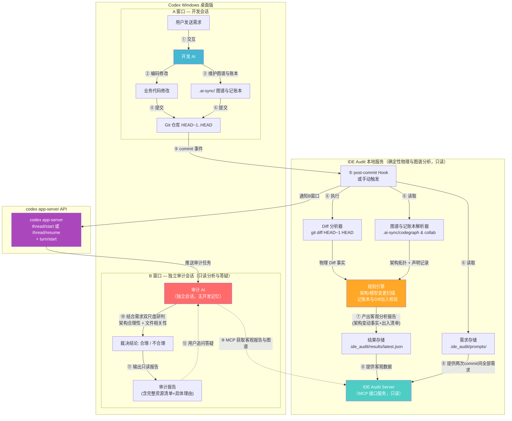
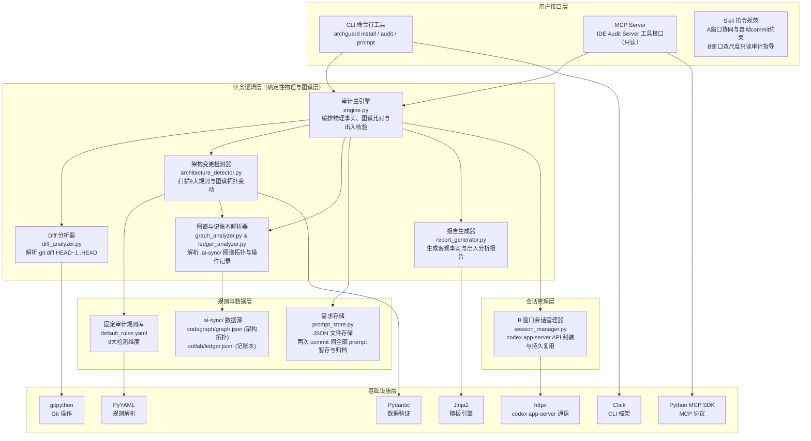
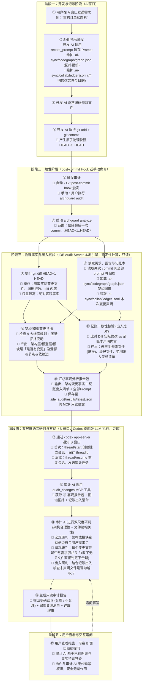

# IDE_Audit — AI IDE 架构审计插件 产品设计文档

> **产品名称**：IDE_Audit
> **设计目标**：构建一个独立于 AI IDE 的旁路审计系统，在 AI IDE 完成每轮开发后，通过**用户原始需求 + git diff** 自动判断变更是否合理，防止 AI 自作主张地修改架构、合并/拆分模块，导致"修一个 bug 却退化另一个功能"的长期项目健康损害。
> **版本**：v1.1（设计版）
> **更新时间**：2026-09-03

---

## 一、项目信息

| 项目 | 值 |
|:---|:---|
| 产品名称 | IDE_Audit |
| 项目类型 | 独立开源项目 |
| 仓库地址 | https://github.com/lndlwh2024/AI_IDE_Audit |
| 工作目录 | H:\AIcode\Antigravity\AI_IDE_Audit |
| 首个适配 | **Codex Windows 桌面版**（ChatGPT desktop app，Powered by Codex & OWL） |
| 包管理 | pip + pyproject.toml |
| 开源协议 | MIT |

---

## 二、核心架构：同一 AI IDE，双窗口分离审计 + 双系统融合

### 2.1 设计原理

```
┌────────────────────────────────────────────────────────────────────────┐
│                   Codex Windows 桌面版（同一个 AI IDE）                   │
│                                                                        │
│   ┌──────────────────────────┐          ┌──────────────────────────┐   │
│   │       A 窗口（开发）       │          │       B 窗口（独立审计）    │   │
│   │                          │          │                          │   │
│   │  · 用户正常交互开发       │          │  · 独立审计员视角        │   │
│   │  · 维护 dual-agent 图谱与账本│       │  · 接收阶段一客观事实报告 │   │
│   │  · 响应指令并 commit 代码 │          │  · 双尺度裁决（架构+文件）│   │
│   │                          │          │  · 绝对只读分析，支持答疑│   │
│   └─────────────┬────────────┘          └─────────────▲────────────┘   │
│                 │                                     │                │
│                 │      跨会话完全隔离（防止自我辩护）     │                │
│                 └───────────────── ╳ ─────────────────┘                │
│                                                                        │
│       共用同一个 LLM（无需额外配置 API Key）                              │
│       B 窗口通过 codex app-server API 自动拉起/复用                       │
└────────────────────────────────────────────────────────────────────────┘
```

### 2.2 核心原则

1. **物理隔离**：A 窗口和 B 窗口是完全独立的会话，不共享推导上下文，防止 A 窗口的自我辩解污染 B 窗口
2. **纯粹客观扫描（阶段一）**：本地规则引擎依据 Git Diff、代码图谱（`codegraph/graph.json`）与记账本（`collab/ledger.jsonl`），仅客观检测架构是否发生变更，以及核验记账本与实际 Diff 的出入差异，**绝不作越权与主观合理性推测**
3. **双尺度综合裁决（阶段二）**：B 窗口结合用户原始需求、图谱拓扑与记账申报，同时审计**架构/模块变更合理性**与**具体修改文件相关性**（架构合理但改了无关文件同样判定不合理）
4. **插件权限绝对只读**：插件与 B 窗口仅提供审查、报告与交互答疑能力，**绝不具备写当前项目的任何权限**，零副作用
5. **支持交互式答疑追问**：报告输出后 B 窗口会话保持持久存活，用户可随时针对审计报告结论发起追问，LLM 持续深入解答
6. **完整需求上下文捕获**：完整收集两次 commit 之间的**所有**用户提示词，确保需求基准无遗漏

### 2.3 核心组件协同关系（插件、Skill、MCP、Git Hook、Dual-Agent-Sync）

| 组件名称 | 表现形式 | 核心职责 | 本架构中的具体动作 |
|:---|:---|:---|:---|
| **IDE_Audit（插件产品）** | Python 包与 CLI 命令行工具（`archguard`） | **总控中枢与规则引擎** | 编排 Diff 解析、加载图谱拓扑、核验记账一致性、生成客观报告。 |
| **dual-agent-sync（协同基石）** | `.ai-sync/`（`collab/` + `codegraph/`） | **架构图谱与操作记账** | 维护全工程文件级依赖图谱（`graph.json`）与操作记录（`ledger.jsonl`），作为审计核心输入。 |
| **Skill（行为规范）** | 注入到 `AGENTS.md` 的 Agent 指令规则 | **AI 员工守则** | 约束 A 窗口：记录 prompt、维护图谱/记账本，改完代码**必须自动执行 `git commit`**。 |
| **MCP（工具通信服务）** | IDE Audit Server（基于标准 MCP 协议） | **只读数据接口** | 为 A 窗口提供 `record_prompt`，为 B 窗口提供客观事实包与图谱查询工具。 |
| **Git Hook（底层触发器）** | 本地 `.git/hooks/post-commit` 脚本 | **自动化引信** | 监听 commit 事件，自动触发分析引擎执行，并唤醒/复用 B 窗口审计会话。 |

```
┌────────────────────────────────────────────────────────────────────────┐
│                        IDE_Audit 完整工作闭环                           │
│                                                                        │
│   [Skill 规范] ──► 驱动 A 窗口写代码并同步更新 .ai-sync/ 账本与架构图谱  │
│                           │                                            │
│                           ▼ (产生物理快照)                              │
│   [Git Hook]   ──► 监听到 commit，立刻拉起本地 IDE Audit Server 分析     │
│                           │                                            │
│                           ▼ (确定性扫描)                                │
│   [引擎分析]   ──► 比对 Diff + 架构图谱 + 记账本 ➔ 产出架构变更与出入报告│
│                           │                                            │
│                           ▼ (只读通信)                                  │
│   [MCP Server] ──► B 窗口审计 AI 继承客观事实，结合需求双尺度研判并答疑  │
└────────────────────────────────────────────────────────────────────────┘
```

### 2.4 如何保证 AI IDE 在代码修改后一定执行 `git commit`？

1. **Skill 行为硬性约束**：
   - 在安装至项目时，`archguard install` 会在项目的 `AGENTS.md`（或 IDE 规则文件）中注入强制指令：
     > “每当响应用户需求完成任何代码生成或修改后，**必须立即在本地执行 `git add .` 与 `git commit -m "..."`**（无需 git push），禁止遗留未提交的变更。”
   - 现代 AI IDE（如 Codex、Claude）具有严格遵守项目规则文件的特性，会将 commit 作为开发生命周期不可或缺的最后一步。
2. **Git Hook 自动感知**：
   - 只要 AI 执行了 `git commit`，底层的 `post-commit` 钩子即刻生效，从而保证整个审计流程 100% 自动触发。
3. **CLI 手工兜底机制**：
   - 若出现 AI 遗漏 commit 的极端情况，用户可随时在终端运行 `archguard commit -m "xxx"`（自动添加变更、提交并触发审计），或直接运行 `archguard audit` 对最后一次 commit 进行审计。

### 2.5 为什么不让开发 AI 自审

| 对比 | 同窗口自审 | 双窗口独立审计（本方案） |
|:---|:---|:---|
| **独立性** | ❌ 差——开发 AI 审计自己，倾向自我辩护与掩盖越权 | ✅ 强——审计 AI 无开发记忆，纯中立视角 |
| **客观证据** | ❌ 无物理交叉比对，易被自身推导误导 | ✅ 强——基于物理 Diff + 图谱拓扑 + 记账出入硬核比对 |
| **LLM 配置** | 无需额外配置 | 无需额外配置（同一个 AI IDE） |
| **用户体验** | 审计混在开发对话流水账中 | 审计在独立窗口，结构化呈现且支持持续追问 |

---

## 三、技术架构

### 3.1 系统架构总览



### 3.2 技术栈架构图



### 3.3 技术栈表

| 组件 | 技术选择 | 版本 | 理由 |
|:---|:---|:---|:---|
| 语言 | **Python** | 3.11+ | LLM/MCP 生态最成熟，社区最大 |
| 包管理 | **pip + pyproject.toml** | — | Python 标准打包方式 |
| CLI 框架 | **Click** | 8.x | 最成熟的 Python CLI 框架 |
| MCP SDK | **Python MCP SDK** | latest | 标准 MCP 协议实现 |
| Git 操作 | **gitpython** | 3.x | 成熟稳定的 Git Python 库 |
| 报告模板 | **Jinja2** | 3.x | 最成熟的 Python 模板引擎 |
| 规则定义 | **YAML + Pydantic** | — | 灵活可扩展，类型安全 |
| 测试 | **pytest** | 8.x | Python 测试标准 |
| 数据存储 | **本地 JSON/YAML 文件** | — | 无需数据库，简单可靠 |
| HTTP 客户端 | **httpx** | latest | 与 codex app-server 通信 |

---

## 四、IDE_Audit 本地服务说明

### 4.1 什么是 IDE_Audit 服务

IDE_Audit 服务是本插件的**核心后台组件**，它是一个**本地运行的 MCP Server 进程**。

| 问题 | 回答 |
|:---|:---|
| 它是什么？ | 一个 Python 进程，提供 MCP 协议工具接口（绝对只读） |
| 在哪里运行？ | **本地**，在用户的电脑上 |
| 怎么启动？ | Codex 桌面版自动管理（STDIO 模式） |
| 需要联网吗？ | ❌ 不需要，所有分析都在本地完成 |
| 需要配置 API Key 吗？ | ❌ 不需要，它不调用任何外部 LLM |
| 具备代码写权限吗？ | ❌ **绝对无写权限**，仅只读提取事实与辅助答疑 |

### 4.2 安装方式

**一次安装，全部搞定**：

```bash
pip install ide-audit
cd /path/to/your-project
archguard install --ide codex-desktop
```

`archguard install` 一条命令自动完成：
- ✅ 注册 MCP Server 到 Codex 配置（`~/.codex/config.toml`，桌面版/CLI/IDE 共用）
- ✅ 安装 A 窗口与 B 窗口 Skill（规则追加到 `AGENTS.md`）
- ✅ 安装 `post-commit` git hook
- ✅ 初始化 `.ai-sync/` 图谱与记账本模板
- ✅ 创建 `.ide_audit/` 本地数据目录

---

## 五、详细审计流程（标注所有生产环节）

### 5.1 完整流程图



### 5.2 各环节执行位置汇总

| 步骤 | 操作 | 执行位置 | 是否依赖 LLM |
|:---:|:---|:---|:---:|
| ① | 用户发送需求 | A 窗口 | — |
| ② | 记录 prompt 到本地；维护 `.ai-sync/` 图谱与记账本 | A 窗口 → MCP/文件 | ✅ 开发 AI |
| ③ | 正常编码修改文件 | A 窗口 | ✅ 开发 AI |
| ④ | git add + commit（产生物理快照） | A 窗口 → Git | ❌ |
| ⑤ | 触发审计（自动 hook 或手动命令） | Git / 用户终端 | ❌ |
| ⑥ | 启动 archguard analyze（限定最后一次 commit） | 本地 CLI 进程 | ❌ |
| ⑦ | **提取 Git Diff HEAD~1..HEAD（最高权重事实）** | IDE Audit Server 本地引擎 | ❌ |
| ⑧ | **读取并归档 Prompt，加载代码图谱与记账本** | IDE Audit Server 本地引擎 | ❌ |
| ⑨ | **架构/模型层变更客观扫描（9大规则+图谱拓扑）** | IDE Audit Server 本地引擎 | ❌ |
| ⑩ | **记账一致性核验（计算 Diff 与记账本出入清单）** | IDE Audit Server 本地引擎 | ❌ |
| ⑪ | **汇总客观分析报告数据包（保存供 MCP 只读暴露）** | IDE Audit Server 本地引擎 | ❌ |
| ⑫ | 通过 codex app-server 通知 B 窗口唤醒/复用 | Hook → app-server API | ❌ |
| ⑬ | 审计 AI 调用 MCP 工具获取客观数据包与图谱 | B 窗口 → MCP | ❌ |
| ⑭ | **双尺度语义研判（架构合理性 + 文件强相关性）** | B 窗口 | ✅ 审计 AI |
| ⑮ | **生成只读审计报告（结论 + 资源清单 + 具体理由）** | B 窗口 | ✅ 审计 AI |
| ⑯ | **用户在 B 窗口针对报告继续交互追问答疑** | B 窗口 | ✅ 审计 AI |

> **核心分工边界**：步骤 ⑦⑧⑨⑩⑪ 为阶段一确定性计算，只做物理与图谱特征扫描及记账出入核验，不作主观越权判断；步骤 ⑭⑮⑯ 由 B 窗口独立会话依据全部事实与图谱拓扑执行双尺度研判与持续答疑，全流程插件保持绝对只读。

### 5.3 触发方式说明

| 触发方式 | 触发条件 | 审计范围 | 使用场景 |
|:---|:---|:---|:---|
| **自动触发** | `post-commit` git hook | 最后一次 commit（`HEAD~1..HEAD`） | 正常开发流程，commit 后自动审计 |
| **手动触发** | 用户执行 `archguard audit` | 最后一次 commit（`HEAD~1..HEAD`） | 需要重新审计、或 hook 未触发时 |

> **重要**：无论自动触发还是手动触发，审计范围**始终且仅限**最后一次 git commit，不包含之前的 commit。

### 5.4 Prompt 捕获机制

```
commit #N-1                     commit #N
    |                               |
    |  prompt1  prompt2  prompt3    |
    |     ↓        ↓        ↓      |
    |  [全部追加到 pending.json]    |
    |                               |
    |  ← 这些 prompt 都属于 →       |
    |    commit #N 的需求上下文      |
    |                               |
    +---------- 审计范围 -----------+
                                    ↑
                            git diff HEAD~1 HEAD
                            + pending.json 中全部 prompt
                            归档后清空 pending.json
```

- **追加模式**：每次用户发送需求时，`record_prompt()` 将需求追加到 `pending.json`（而非覆盖）
- **归档清空**：审计时读取 `pending.json` 中的全部需求，归档到 `archived/` 目录，然后清空 `pending.json`
- **完整上下文**：确保审计 AI 看到的是用户在本次开发周期中的**全部意图**，而非仅最后一条

---

## 六、审计窗口会话管理

### 6.1 会话策略

| 场景 | 行为 | 技术实现 |
|:---|:---|:---|
| **首次审计** | 创建 B 窗口审计会话 | `codex app-server` → `thread/start` → 获取 `threadId` → 保存到 `.ide_audit/session.json` |
| **后续 commit** | **复用同一个 B 窗口**，发送新审计任务 | 读取 `threadId` → `thread/resume` → `turn/start` 发送审计消息 |
| **Codex 桌面版重启后** | 尝试恢复，失败则新建 | 尝试 `thread/resume`，若失败则重新 `thread/start` |

### 6.2 B 窗口会话复用流程

```
第一次 commit:
  创建 Audit B
  ↓
  获得 threadId = abc123
  ↓
  保存 abc123 到 .ide_audit/session.json

第二次 commit:
  读取 abc123
  ↓
  thread/resume abc123
  ↓
  turn/start
  ↓
  "这是本次 git diff，请审计"
  → 审计报告 #2

第三次 commit:
  仍然 abc123
  ↓
  继续审计
  → 审计报告 #3

Codex 桌面版重启后:
  尝试 thread/resume abc123
  ↓
  若成功 → 继续复用
  若失败 → thread/start 新建 → 新 threadId
```

### 6.3 为什么复用 B 窗口

1. **避免窗口爆炸**：频繁 commit 不会打开大量窗口
2. **历史可追溯**：同一个审计会话中可以看到历次审计报告的对比
3. **用户体验**：用户始终在同一个 B 窗口查看审计结果

### 6.4 审计报告持久化

即使 B 窗口会话被清理，审计报告也通过本地文件持久化：
- 审计结果保存在 `.ide_audit/results/` 目录
- 审计报告保存在 `.ide_audit/reports/` 目录
- 可通过 `archguard history` 命令查看历史审计记录

---

## 七、审计裁决机制与两阶段工作准则

### 7.1 两阶段定位与核心分工

```
  ┌──────────────────────────────────────────────────────────────────────────┐
  │ 阶段一：IDE_Audit 本地分析阶段（确定性计算，只做物理扫描，不作合理性判断）  │
  │                                                                          │
  │  【三项客观输入】                                                         │
  │   1. Git Diff（最高权重物理事实：实际修改了哪些文件的哪些行）                │
  │   2. dual-agent-sync 架构图谱（当前项目的真实模块与拓扑结构）              │
  │   3. dual-agent-sync 代码记账本（A 窗口记录的操作清单，作为被审计对象）      │
  │                                                                          │
  │  【规则引擎与图谱比对计算】                                                │
  │   · 比对 Diff 与代码图谱：是否有新模块、跨层依赖、接口或模型定义变动？      │
  │   · 比对 Diff 与记账本：实际改动的代码，与记账本登记的内容是否有出入？      │
  │                                                                          │
  │  【唯一客观产出】                                                         │
  │   输出：【架构与模型变更客观分析报告】                                     │
  │   · 明确标识：架构层/模型层/模块层「是否有变更」                            │
  │   · 列出物理变更详情：改动了哪些架构节点、新增了哪些依赖边、影响了哪些模块  │
  │   · 明确标识：记账本与 Git Diff 的出入差异清单（未声明偷改、虚报、范围出入） │
  └────────────────────────────────────┬─────────────────────────────────────┘
                                       │ (只读传输分析事实)
                                       ▼
  ┌──────────────────────────────────────────────────────────────────────────┐
  │ 阶段二：B 窗口独立审计阶段（LLM 综合研判，绝对只读，支持交互答疑）         │
  │                                                                          │
  │  【B 窗口输入】                                                           │
  │   1. 阶段一输出的【架构是否变更的客观分析报告】                             │
  │   2. 用户在两次 commit 之间的【原始需求 Prompt】                           │
  │   3. 项目【代码图谱】（全局拓扑全景）                                      │
  │   4. 【代码记账本】（A 窗口的操作记录，仅作为核验参考）                    │
  │                                                                          │
  │  【LLM 双尺度综合裁决】                                                   │
  │   · 宏观尺度：架构/模块层变更，是否在用户原始需求的授权与合理范围内？        │
  │   · 微观尺度（严格文件相关性）：每个修改的文件，是否与本次需求紧密相关？   │
  │     （重要铁律：即使架构变更有理，但只要改动了无关业务文件，同样判定不合理）│
  │   · 出入核验：结合记账出入清单，核查未声明的改动是否为恶意或隐秘越权？     │
  │                                                                          │
  │  【裁决结果输出】                                                         │
  │   · 若【合理】：输出变更资源清单 + 充分的合理性理由 (各文件对应需求依据)    │
  │   · 若【不合理】：输出不合理/越权资源清单 + 详细指责理由 (指出哪个文件无关) │
  │                                                                          │
  │  【运行属性与权限约束】                                                   │
  │   · 纯只读报告：插件绝不具备对当前工程的任何文件写权限，杜绝任何副作用     │
  │   · 交互式答疑：报告输出后 B 窗口会话持续保持，支持用户继续追问深入解答   │
  └──────────────────────────────────────────────────────────────────────────┘
```

### 7.2 裁决判定准则矩阵表

| 场景 | 架构/模块层变更 | 变更文件与需求相关性 | 记账与Diff一致性 | B 窗口综合裁决结论 | 报告输出与理由要求 |
|:---:|:---:|:---:|:---:|:---:|:---|
| **1** | 无架构变更 | 所有变更文件均与需求强相关 | 记账与实际一致 | ✅ **合理** | 输出变更文件清单、通过原因及各文件对需求的支撑逻辑 |
| **2** | **检测到架构变更**（如拆分模块/新建表） | **需求明确授权该架构重构**，且修改文件均强相关 | 记账准确声明了架构变动 | ✅ **合理** | 输出架构变更资源清单，列出符合需求的证据与图谱影响分析 |
| **3** | **架构变更合理**（需求允许） | **改动了无关业务文件**（如顺手改了隔壁模块代码） | 无论记账是否提及 | ❌ **不合理** | **明确列出无关文件的具体越权修改**，阐明其与本次需求脱节的理由 |
| **4** | **非预期架构变更**（如仅要求打日志却改了表） | — | — | ❌ **不合理** | 指出未授权架构变更信号，警示破坏性并列出越权清单 |
| **5** | — | — | **存在严重瞒报**（Diff改了核心文件但记账本完全隐瞒） | ❌ **不合理** | 重点标出记账出入信息，指出存在隐瞒未经说明的代码偷改 |

---

## 八、架构变更检测规则（固定规则库）

| 检测维度 | 检测信号 | 严重级别 |
|:---|:---|:---:|
| **文件/目录结构变更** | 新增/删除/移动目录、模块文件重命名 | 🔴 高 |
| **数据库 Schema 变更** | migration 文件新增、ALTER/CREATE/DROP | 🔴 高 |
| **API/接口变更** | 路由定义增删、函数签名变更 | 🔴 高 |
| **模块合并/拆分** | 多模块代码合并到单文件或反向拆分 | 🔴 高 |
| **安全边界变更** | 认证/授权逻辑修改、密钥处理变更 | 🔴 高 |
| **执行模型变更** | 并发模型、调度机制、消息队列变更 | 🔴 高 |
| **模块依赖边界变更** | import 关系跨越已定义模块边界 | 🟠 中 |
| **配置/环境变更** | 环境变量、构建配置、部署配置修改 | 🟠 中 |
| **共享契约变更** | 类型定义、接口定义、共享常量修改 | 🟠 中 |

---

## 九、MCP Server 工具设计（绝对只读数据接口）

IDE Audit Server 暴露给 AI 助手的工具集遵循**严格只读原则**，不具备任何修改用户源码的权限：

### 工具 1：`record_prompt`
A 窗口调用，记录用户原始需求。
- **追加模式**：每次调用将需求追加到 `.ide_audit/prompts/pending.json`
- **支持多条**：两次 commit 之间可记录多条用户需求
- **时间戳标记**：每条 prompt 带有 ISO 8601 时间戳，便于排序和回溯

### 工具 2：`audit_changes`
B 窗口调用，获取规则引擎提取的客观分析报告包。返回结构化 JSON：
- **用户原始需求**：两次 commit 之间的全部 prompt 列表
- **commit 快照**：本次审计的 commit hash（HEAD）与 commit message
- **物理 Diff 事实**：变更文件总数、增删行数、文件路径及修改类型
- **架构变更客观信号**：架构层/模型层/模块层「是否有变更」及受影响的图谱节点与依赖边
- **【核心出入清单】记账一致性核验结果**：
  - 未声明私自修改的文件清单（Diff 实际修改但记账本未报，存在偷渡嫌疑）
  - 虚报修改的文件清单（记账本声称修改但 Diff 实际未改）
  - 修改范围/行号区间的出入明细

> **设计准则**：此工具仅返回纯粹的客观事实、图谱拓扑变动与记账出入数据。**双尺度裁决（架构合理性 + 文件强相关性）**全权由调用该工具的 B 窗口 LLM 进行独立推理并出具报告。

### 工具 3：`get_architecture_graph`
B 窗口调用，按需读取全项目或特定模块的代码架构图谱（`.ai-sync/codegraph/graph.json`）：
- 模块划分与文件节点职责（`purpose`、`exports`）
- 文件间依赖调用边（`imports`、`api_calls`、`extends` 等）

### 工具 4：`get_ledger_records`
B 窗口调用，读取本次 commit 对应的记账申报记录（`.ai-sync/collab/ledger.jsonl`），用于比对 A 窗口声称的工作范围与实际 Diff。

### 工具 5：`get_file_diff`
B 窗口按需调用，获取特定文件的具体代码增删 diff 片段，用于核验敏感代码或有争议文件的改动细节。

---

## 十、目录结构

```
H:\AIcode\Antigravity\AI_IDE_Audit\
├── archguard/                     # Python 包
│   ├── __init__.py
│   ├── core/                      # 核心引擎（确定性物理与图谱层，不调用 LLM）
│   │   ├── __init__.py
│   │   ├── engine.py              # 审计主引擎（编排 Diff 分析、图谱扫描与出入核验）
│   │   ├── diff_analyzer.py       # Git Diff 解析（限定 HEAD~1..HEAD）
│   │   ├── architecture_detector.py  # 9 大维度架构信号扫描器
│   │   ├── graph_analyzer.py      # 代码图谱解析与依赖拓扑变动分析器（新增）
│   │   ├── ledger_analyzer.py     # 记账本与 Diff 出入核验器（新增）
│   │   ├── prompt_store.py        # 需求存储与生命周期管理（追加模式，归档清空）
│   │   └── report_generator.py    # 客观事实报告生成器（Markdown 渲染）
│   │
│   ├── rules/                     # 审计规则定义
│   │   ├── __init__.py
│   │   ├── schema.py              # 规则与信号 Pydantic 模型
│   │   ├── default_rules.yaml     # 默认规则集（9大检测维度）
│   │   └── loader.py              # 规则加载器
│   │
│   ├── mcp/                       # MCP Server 实现（IDE Audit Server，只读接口）
│   │   ├── __init__.py
│   │   └── server.py              # STDIO MCP 服务端入口
│   │
│   ├── adapters/                  # IDE 适配层
│   │   ├── __init__.py
│   │   ├── codex/                 # Codex 桌面版适配
│   │   │   ├── __init__.py
│   │   │   ├── installer.py       # 一键安装与配置注入
│   │   │   ├── session_manager.py # B 窗口会话管理（codex app-server API 封装）
│   │   │   ├── skill_template.md  # A 窗口 Skill 规范模板（含自动 commit 约束）
│   │   │   └── audit_prompt.md    # B 窗口审计 prompt 模板（双尺度裁决与交互答疑）
│   │   └── git_hook.py            # Git Hook 管理
│   │
│   ├── cli/                       # 命令行界面
│   │   ├── __init__.py
│   │   ├── main.py                # archguard 命令入口
│   │   └── commands/
│   │       ├── __init__.py
│   │       ├── audit.py           # 手动审计（archguard audit）
│   │       ├── commit.py          # 提交并审计（archguard commit）
│   │       ├── install.py         # 安装到项目（archguard install）
│   │       ├── graph.py           # 查看架构图谱（archguard graph）
│   │       ├── prompt.py          # 手动记录需求
│   │       └── history.py         # 查看审计历史
│   │
│   └── config/
│       ├── __init__.py
│       └── settings.py            # 路径与目录配置管理
│
├── templates/
│   ├── audit_report.md.j2         # 客观事实报告模板
│   ├── skill_codex_dev.md         # A 窗口开发规则模板
│   └── skill_codex_audit.md       # B 窗口审计指导模板
│
├── tests/
│   ├── __init__.py
│   ├── test_diff_analyzer.py      # Git Diff 解析测试
│   ├── test_architecture_detector.py # 9 大规则扫描测试
│   ├── test_graph_analyzer.py     # 图谱拓扑分析测试
│   ├── test_ledger_analyzer.py    # 记账出入核验测试
│   ├── test_engine.py             # 主引擎端到端测试
│   ├── test_prompt_store.py       # Prompt 存储测试
│   └── fixtures/
│
├── docs/
│   ├── PRODUCT_DESIGN.md          # 本文档
│   └── ARCHITECTURE.md            # 技术架构文档
│
├── pyproject.toml
├── README.md
├── LICENSE
└── .gitignore
```

### 项目根目录下的数据源与工作目录

1. **`.ai-sync/`（由 dual-agent-sync 维护，IDE_Audit 只读接入）**：
   - `codegraph/graph.json`：全局文件级架构图谱与依赖边
   - `collab/ledger.jsonl`：操作记账本与变更范围申报
2. **`.ide_audit/`（IDE_Audit 专用本地审计数据目录）**：
   - `prompts/pending.json`：两次 commit 间暂存的用户需求
   - `prompts/archived/`：历史需求归档
   - `results/latest.json`：最近一次客观分析报告数据包
   - `results/history/`：历史分析数据
   - `reports/`：Markdown 审计报告归档
   - `session.json`：B 窗口 threadId 持久化

---

## 十一、开发计划（重新规划为 4 个阶段）

### 阶段一：核心物理审计引擎（✅ 已完成，v0.1.0）
- Git Diff 解析器（限定 `HEAD~1..HEAD`，兼容根提交）
- 9 大架构检测维度规则库与模式扫描器
- Prompt 追加存储与生命周期归档（`pending.json`）
- 客观报告生成器与审计主引擎编排
- 27 个单元测试 100% 通过，已推送到 GitHub

### 阶段二：CodeGraph 架构图谱与记账出入核验（当前阶段）
- **图谱分析模块**（`core/graph_analyzer.py`）：解析 `codegraph/graph.json`，构建内存拓扑图，检测跨模块非法依赖引入、分层边界击穿与循环依赖。
- **记账核验模块**（`core/ledger_analyzer.py`）：比对 Git Diff 实际改动与 `collab/ledger.jsonl` 申报范围，精确计算出瞒报（未声明修改）、虚报与行号出入差异。
- **主引擎升级**（`core/engine.py`）：融合 Diff 事实、图谱拓扑变动与记账出入数据，输出标准化客观事实分析包。
- **全套单元测试**：针对图谱变动检测与记账出入核验编写测试套件。

### 阶段三：MCP Server + Codex 双窗口只读交互适配
- **IDE Audit Server**（`mcp/server.py`）：基于标准 Python MCP SDK 实现，暴露只读工具集（`audit_changes`、`get_architecture_graph`、`get_ledger_records`、`record_prompt`）。
- **Codex 桌面版适配**（`adapters/codex/`）：
  - `session_manager.py`：封装 `codex app-server` API，管理 B 窗口独立 threadId，实现首启创建、后续无感复用。
  - `installer.py`：一键将 MCP STDIO 注册到 `~/.codex/config.toml`。
- **双端 Skill 模板**：
  - A 窗口 Skill：约束自动 commit 与 `.ai-sync` 图谱记账维护。
  - B 窗口 Skill：指导审计 LLM 依据客观报告执行**双尺度裁决（架构合理性 + 文件强相关性）**，并支持持续答疑。

### 阶段四：CLI 工具链、全场景集成测试与发布
- **CLI 命令行**（`archguard`）：`install`、`audit`、`commit`、`graph`、`history` 完整命令矩阵。
- **真实场景端到端联调**：在实际双窗口协同场景中验证自动触发、图谱分析、出入核验与裁决答疑闭环。
- **文档与部署发布**：更新 README、使用指南，发布正式版本。

### 后续扩展

- Cursor 适配
- Antigravity 适配
- Claude Code 适配
- 审计历史与趋势分析
