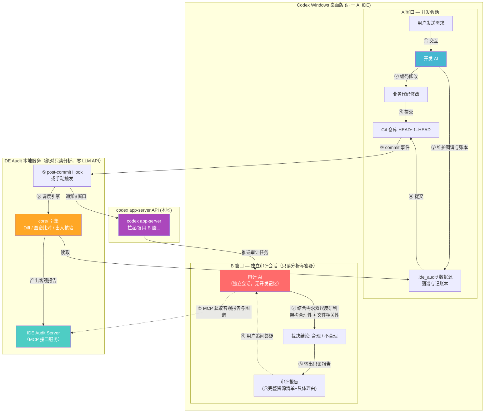
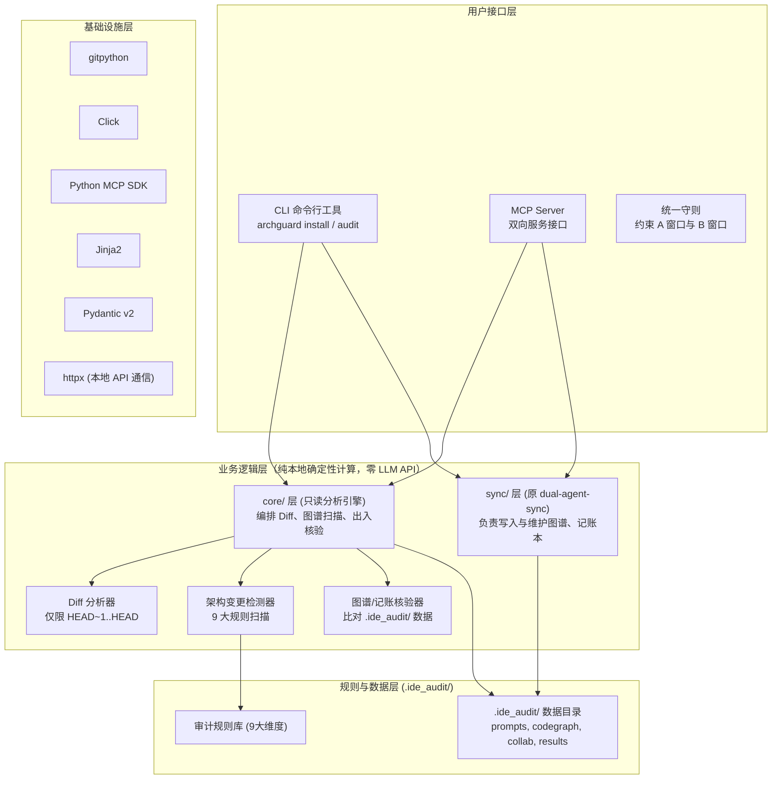
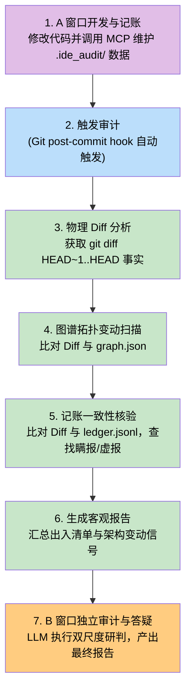

# IDE_Audit 产品设计文档 (V2.0 终局融合版)

## 0.4.2 修订：一行文档验收故障（2026-09-12）

最新条款覆盖前文：get_project_status 会报告当前开发 MCP 已接入的协同会话；同一服务、同一会话已经 ready 且 enabled 时不重复接入刷新。新服务首次接入及暂停恢复仍由 A 更新。

普通新增 .md/.rst/.txt 说明文件不自动成为工作态架构节点；已有人工声明的文档节点仍保留。图谱语义不变时只更新本地扫描缓存，不递增图谱版本、不重写 graph.json、GRAPH_SUMMARY.md 或图谱变更日志。物理 Git 文件清单和逐文件审计仍包含这些文档，不以此绕过文档越权核查。

提交 Hook 使用 UTF-8，通知命令先持久入队再显示短摘要，避免报告输出失败阻断派发。原始完整报告仍在本地。旧托管 Hook 只在哈希仍匹配时升级，保留旧 Hook 链；外部修改不覆盖。

事件 MCP 暴露 OperationEvent 的实际结构，避免模型猜字段名。A 按依赖编排调用、已完成接入不重复执行、未知故障移交插件开发任务；不通过省略原文记录、未读理解、租约或 B 审计来减少调用。

阶段起止计数相同只代表无新增观测，显示待结算/未知，不能称为零成本。长 A 上下文随每轮调用携带，少量 diff 不等于少量总输入；当前不能承诺普通提交的固定配额成本或固定节省比例。

NEWS 的 db8aec5ffe221585a47224a4c76e54ce327141df 已有完整封存证据。GBK 异常发生在原通知命令入队前，无队列、无 B；文档第 1 行漏申报是待 B 判断的证据，并非 analysis_status 不完整。不修改该提交、原申报或其既有图谱版本。修复验证不自动运行 NEWS 大模型，恢复时使用同一提交，避免制造第二个测试提交。


## 0.4.1 修订：启用故障、任务名称与用量控制（2026-09-11）

本节为最新需求基线，覆盖下文旧版关于全图交接、仅 B 用量及 NEWS 尚未迁移的描述。

- B 名称固定为 `🔔<项目名称>项目审计窗口-<序号>`。同一当前 B 连续提交复用，归档或确实丢失后新建递增；新 B 只接收当次封存需求与证据，不回放旧 B 聊天。历史 B 的聊天由 Codex 保存，插件不复制进新 B。
- A 在初次同步、编辑前核对、提交后维护开始时记录阶段起点，完成或失败后立即打印本次及本窗口累计 token。B 在审计完成后同样打印。使用指定任务的宿主计数；缓存输入属于输入子集，不能重复相加。不用账户额度换算 token，来源缺失、计数回退时显示未知；最终回复尚未结算的部分不伪称已统计。
- A 维护调用返回图谱摘要和扫描计数；未读账本分批返回（默认最多 10 条、12000 字符），确认已读页后继续。恢复同一 A 复用协同 session_id，不能每次从零创建游标。首次新会话确有历史交接成本，后续无新事件不发送全图。禁止为取得全量 JSON 而回退到 shell 打印整个图谱/账本。
- B 证据保留全部原始需求、该次 diff、申报与物理分析；四份图谱只发送本次文件及一跳入出依赖，完整证据保留本地，缺证时定点请求。事实包超过 64000 字符时停止派发并说明原因，不静默截断，不用部分证据作全局无风险结论。超大提交暂需拆分或人工分段审阅。
- Python 扫描支持 BOM UTF-8/16/32 和 Python 编码声明。明确标为 non_active 的旧文件仍无法解析时，保留原语义并标为未验证，展示覆盖警告；活跃文件解析失败仍阻断。该历史文件本次被修改或重命名时，物理审计仍报告缺证，不能由非活跃标签绕过。
- 依赖缓存及构建目录默认不扫描；已被 Git 跟踪的文件不因构建目录名而丢失，插件自身元数据始终排除。未变化源码复用本地内容/AST 缓存；仍需枚举候选路径与重算依赖目标，不能宣传为完全不扫描。图谱纯本地维护不调用模型。
- 大任务用量日志改为首次本地读、随后从检查点追加读取；校验宿主项目、任务、文件及尾部指纹，不将对话正文传入模型。
- NEWS 原 Skill 资产已在插件之外切换并归档；旧 Skill 已停用。本次修复不修改旧业务文件。原 A 通过外部修复脚本核对旧已读版本并继承 139 行检查点，只处理剩余事件。该脚本不进入插件或 wheel，NEWS 真实提交/B 闭环仍由后续验证确认。

消耗判断：NEWS 失败同步时尚无 B。宿主可观测的 21 次记录段约 175 万 token，约 139 万为缓存输入，包含长 A 历史上下文和排查交互。旧版重复全图交接另有持续成本问题，0.4.1 已限制传输。保留长 B 会话仍会携带历史，不能保证每次审计成本恒定；正常提交的实机额度降幅尚无对照，不承诺固定节省比例。


## 0.4.0 需求基线与确认状态（历史记录，2026-09-10）

本文统一收录历次需求与实现方案，避免新增条款只存在于聊天或文档顶部而与正文冲突。0.3.0 为历史基线；本次方案与文档已获用户确认，0.4.0 实现项目授权、暂停/A 恢复和 B 用量。市场发布暂不执行，NEWS 工具独立交付、实际迁移尚未执行。

| 编号 | 功能 | 要求与实施状态 |
|:---|:---|:---|
| F01 | 单插件完整融合 | 替代 dual-agent-sync 的逻辑能力；旧业务历史迁移不进入插件。0.3.0 已实现基础交付，见能力对照与验收记录。 |
| F02 | 项目独立授权 | Codex 安装插件不等于项目开启。每个项目的 A 首次进入或恢复时询问，用户明确同意才运行全套能力。0.4.0 已实现。 |
| F03 | 项目状态与控制 | 未选择、拒绝、初始化/待 A 同步、已开启、已暂停；A/B 均可暂停、请求恢复及查询。0.4.0 已实现。 |
| F04 | A 独占维护职责 | 首次建图、再次接入刷新、暂停后恢复、代码信息同步与账本交接均由 A 完成。接入刷新已有实现，暂停恢复编排已在 0.4.0 实现。 |
| F05 | 固定提交两阶段审计 | 真实 Git 事实、原始需求、图谱及账本封存；B 判断架构授权及每个文件的需求强相关性。0.3.0 已实现。 |
| F06 | 同项目原生 B | 使用 Codex 大模型；同次运行复用 B，正常重入优先恢复；归档/确实丢失才递增编号新建。不以插件页面代替模型。0.3.0 已实现并有实机证据。 |
| F07 | B 有限取证与答疑 | B 使用 A 提供的图谱、同步信息和固定事实包，必要时定点读取相关文件；不得重新大范围扫描项目建立架构认识。新增明确约束待落实。 |
| F08 | B token 知情权 | 记录本轮、本 B 累计及本项目各 B 的已记录用量，审计后展示、随时可查询；真实来源、去重、缺失标注。0.4.0 已实现。 |
| F09 | 可靠协同与队列 | 增量图谱、租约续期、可恢复交接、提交队列与原生消息桥接；新增项目开关须覆盖所有入口及后台进程。0.4.0 已接入项目控制。 |
| F10 | 分发 | 已有 GitHub Release 和本机个人插件安装；后续可建设公开插件源，官方目录须先确认本地 MCP 收录路径。市场工作暂不执行。 |
| E01 | NEWS 外部快速切换 | 仅保留旧图谱、同步信息及已有数据资产，单向切换后下线 NEWS 的旧 Skill；不开发迁移回滚或新旧双轨兼容。插件外工作，待产品更新后执行。 |

A/B 是角色，项目是授权边界。同一项目多个任务共享项目选择；另一个项目不继承选择。未授权时只允许展示启用询问和查询/管理授权，不启动业务扫描、需求采集、记账、自动提交、队列或 B。用户普通开发不受插件未启用影响。

> **产品名称**：IDE_Audit
> **设计目标**：构建一个集**代码架构图谱系统、操作协同记账本、物理事实检测与独立双窗口审计**于一体的 AI IDE 插件，在项目授权范围内识别未授权架构修改、依赖破坏及无关文件变更；不将模型审计表述为绝对无遗漏保证。
> **版本**：v2.0（终局融合版）
> **更新时间**：2026-09-10（方案、文档及开发已确认）

> **实施状态补充（2026-09-09）**：本文定义终局目标，不代表所有能力已经实现。当前 `0.3.0` 已实现此前确认的基础功能并完成真实 Codex 同项目双轮裁决；F02/F03/F07/F08 已在 0.4.0 实现，宿主完整重启仍未实测；完成度与剩余验收门以 `HANDOVER.md`、`DEVELOPMENT_PLAN.md` 和 `DUAL_SYNC_PARITY.md` 为准。

> **B 形态补充**：A 在 NEWS 项目开发时，B 必须是 NEWS 项目下的独立审计会话，并可自动打开；仅 cwd 相同或出现在全局任务列表不满足要求。正常重启优先恢复原 B 及历史；原会话确实不存在时可重建空白 B，不默认重放已删除聊天。参见 `B_SESSION_POLICY.md`。

---

## 📝 V2.0 版本更新日志 (Changelog)

### 按时间记录的需求与方案修订

| 日期/轮次 | 需求变化 | 方案变化及状态 |
|:---|:---|:---|
| 2026-09-04 初版 V2 | 将 dual-agent-sync 完整融合为独立产品 | 统一 sync/core/MCP/双窗口架构；V1.0 保留作历史档案。 |
| 2026-09-08 审计 | 原交接“全部完成”与真实实现不符 | 固定事实链、角色分离、真实 B、事务与交付验收成为修复目标；证据见 HANDOVER。 |
| 2026-09-09 范围澄清 | 继承逻辑能力，不要求插件保留旧业务内容；NEWS 迁移在插件外 | 去除产品内迁移耦合；A 首次建图、再次刷新；旧项目工具单独交付。 |
| 2026-09-09 B 生命周期 | 同项目原生 B；连续提交复用，归档/删除后允许新建；接受 B 宿主读写权限 | 真实 projectId 绑定；活动写入者走原生桥接；序号递增；不自动删除、不回放已删除聊天。 |
| 2026-09-09 至 09-10 发布 | 完成 0.3.0 基础交付 | 103 项本地测试、四组 CI、真实双轮 B 与归档替代；整桌面强退重启未实测。 |
| 2026-09-10 项目授权/暂停 | 全局安装与每项目启用分离；A/B 均可暂停，保留数据 | 统一后端状态门禁；恢复先同步最新状态，默认不补审暂停期间逐次提交。0.4.0 已实现。 |
| 2026-09-10 本次 A/B 边界 | 恢复同步必须由 A 完成；B 不重新大范围扫描认识架构 | B 发起恢复只能进入“待 A 同步”，A 完成后才恢复自动审计。已确认并实现。 |
| 2026-09-10 本次用量 | B 必须记录并展示 token 消耗 | 基于宿主真实用量，按请求/轮次去重，分类展示、累计留存，未知不填零。已实现；原生 B 用量读取已实测。 |
| 2026-09-10 本次 NEWS 简化 | 当前仅 Codex 使用 NEWS；保留资产、快速切断旧工作流 | 取消此前迁移回滚和双轨兼容计划；外部转换、验证后下线项目旧 Skill，问题在新插件修复。未执行迁移。 |

下列主题日志说明原始 V2 设计动机；当前功能与验收以本次需求表和正文最新条款为准。

### 1. 核心战略升级：全面内生整合 dual-agent-sync，下线原独立 Skill
- **原状态（V1.0）**：将 `dual-agent-sync` 作为外部依赖，假定用户在项目中独立安装该 Skill；IDE_Audit 仅被动读取其产物。
- **现状态（V2.0）**：**IDE_Audit 完全内生吞并整合 `dual-agent-sync` 的全部底层能力**（代码架构图谱 AST 解析与增量维护、操作协同记账本标准读写、多会话游标追踪、并发排他锁控制）。
- **终局目标**：完成后**彻底废弃并下线独立的 `dual-agent-sync` skill**。开发者只需安装 `IDE_Audit` 这一个插件，即可获得原 Skill 的全部协同图谱能力 + IDE_Audit 的独立架构审计能力。

### 2. 核心架构澄清：100% 纯本地运行，零外部 LLM API
- **绝不调用任何商业 LLM API**：IDE_Audit 本地服务（引擎、MCP Server、图谱分析器、记账校验器）均为 100% 纯 Python 本地确定性进程，不发任何网络 AI 请求，无需配置任何 OpenAI/Claude/Anthropic API Key。
- **智能大脑归位**：所有的智能理解、业务编码与审计研判，全部由用户正在使用的 **Codex 桌面版自带的 AI（A 窗口开发，B 窗口独立审计）** 承担。

### 3. 两阶段工作准则彻底定稿
- **阶段一（IDE_Audit 确定性物理与图谱分析）**：
  - 输入最高权重 Git Diff（`HEAD~1..HEAD`）+ 代码图谱（`.ide_audit/codegraph/graph.json`）+ 记账本（`.ide_audit/collab/ledger.jsonl`）；
  - 确定性扫描：架构层/模型层「是否有变更」及依赖拓扑破坏；
  - **记账一致性出入核验**：纯数学计算 Diff 与记账本的出入清单（未声明偷改、虚报、行号范围偏差）；
  - **绝对只读**，不作任何主观越权或合理性推断。
- **阶段二（B 窗口独立审计会话，双尺度裁决与交互答疑）**：
  - 继承阶段一客观分析报告、用户原始需求、代码图谱与记账申报；
  - **双尺度研判**：① 宏观研判架构变更合理性；② 微观研判**修改文件强相关性（铁律：即使架构变更有理，改了无关文件也判定为不合理！）**；
  - **交互答疑与权限约束**：B 可有宿主读写权限，但审计仅核查证据和答疑，不维护图谱或修改业务代码；core 和审计查询接口只读，状态及用量由独立控制/存储层维护。

---

## 一、项目基本信息

| 项目 | 说明 |
|:---|:---|
| **产品名称** | IDE_Audit（内置 dual-agent-sync 全部能力） |
| **开源仓库** | https://github.com/lndlwh2024/AI_IDE_Audit |
| **工作目录** | `H:\AIcode\Antigravity\AI_IDE_Audit` |
| **首个适配** | **Codex Windows 桌面版**（ChatGPT desktop app，Powered by Codex & OWL） |
| **技术栈** | Python 3.11+, pip + pyproject.toml, Click, MCP SDK, gitpython, Jinja2, Pydantic, httpx, pytest |
| **外部 LLM 依赖** | **零依赖**（不调用任何第三方大模型 API，无需任何 API Key） |
| **开源协议** | MIT |

---

## 二、双系统融合架构：内生整合 dual-agent-sync

### 2.1 融合设计原理

原 `dual-agent-sync` 作为纯提示词（Skill），其致命缺陷在于靠大模型的“自觉性”维护数据，极易发生格式错乱、遗漏记账或并发锁失效。
IDE_Audit 将其全部核心逻辑下沉为**本地 Python 确定性服务**：

```text
┌─────────────────────────────────────────────────────────────────────────────┐
│                            IDE_Audit 一体化系统架构                          │
├──────────────────────────────────────┬──────────────────────────────────────┤
│  【原 dual-agent-sync 吞并整合层】   │        【IDE_Audit 核心审计层】      │
│                                      │                                      │
│  1. 架构图谱内核 (archguard.sync.graph)│  1. 物理事实解析 (core.diff_analyzer)│
│     · AST 静态语法树全库解析与拓扑生成│     · 严格限定 HEAD~1..HEAD 真实改动 │
│     · 增量更新与依赖调用边提取        │  2. 规则检测引擎 (core.arch_detector)│
│  2. 操作记账内核 (archguard.sync.ledger│     · 9 大架构/模型特征维度扫描      │
│     · 标准化记录改动文件、行号与目的 │  3. 记账出入核验 (core.ledger_check) │
│     · 严格校验格式，绑定 commit 快照 │     · 纯集合运算检测偷渡改动与虚报   │
│  3. 协同锁内核 (archguard.sync.lock) │  4. 会话管理 (adapters.codex.session)│
│     · Python 物理排他锁与会话游标管理│     · 自动拉起/复用 Codex 独立 B 窗口│
│  4. 统一 A 窗口 Skill 守则           │  5. 审计研判与答疑 (B 窗口 LLM 驱动) │
│     · 指导 AI 标准调工具记账与自动 commit│     · 双尺度研判（架构合理+文件相关）│
└──────────────────────────────────────┴──────────────────────────────────────┘
```

### 2.2 单一产品与项目授权接入
1. **安装不启用**：Codex 安装只提供插件能力和轻量接入提示；用户对当前项目明确授权后，才配置项目入口并由 A 初始化。
2. **单一规范**：已启用项目使用 IDE_Audit 统一开发守则，自动提交等行为均受项目状态约束。普通安装不扫描或移除任何旧 Skill。
3. **数据统一**：产品使用 `.ide_audit/` 保存协同和审计资产；暂停保留数据。旧 `.ai-sync` 的转换、保留和停止使用由项目外迁移操作负责。
4. **现状区别**：0.3.0 安装器直接配置项目 MCP/Hook；需要改为授权后的接入动作，旧安装不能被静默视为对新增机制的同意。

### 2.3 核心组件协同关系

| 组件名称 | 表现形式 | 核心职责 | 本架构中的具体动作 |
|:---|:---|:---|:---|
| **IDE_Audit（核心产品）** | Python 包与 CLI 命令行工具 | **总控中枢与规则引擎** | 编排 Diff 解析、加载图谱拓扑、核验记账一致性、生成客观报告。 |
| **archguard.sync 内核** | `sync/` 模块下的本地服务 | **架构图谱与操作记账维护** | 维护全工程文件级依赖图谱与操作记录，数据存放在 `.ide_audit/` 下。 |
| **Skill（行为规范）** | 注入到 `AGENTS.md` 的指令 | **AI 员工守则** | 约束 A 窗口：记录 prompt、调用 MCP 工具维护图谱/记账，项目已开启且本轮完成后，只提交授权范围的代码。 |
| **MCP（工具通信服务）** | IDE Audit Server | **双向通信接口** | 为 A 窗口提供记账写入口；为 B 窗口提供客观事实包与图谱查询等**只读**接口。 |
| **Git Hook（引信）** | 本地 `post-commit` 脚本 | **自动化触发器** | 项目已开启时监听 commit，触发本地分析及 B 队列；未启用/暂停时立即退出，不影响正常提交。 |

### 2.4 sync/ 与 core/ 的边界声明
- **`sync/` 模块**：负责**数据写入与维护**，目标是 100% 继承原 dual-agent-sync 的功能，包括图谱和协同记账本。当前自动 AST 解析覆盖 Python，其他语言关系和语义通过统一工具人工声明；完整等价需按原始能力基线验收。它是开发阶段 A 窗口的操作支撑层。
- **`core/` 模块**：负责**只读分析与扫描**，包括 Diff 提取、比对图谱变化、核验记账一致性。它是审计阶段的核心引擎，绝对不修改任何源码和图谱数据。
两者互不干扰，但同属于一个 `IDE_Audit` 进程，共享本地数据目录。

### 2.5 如何保证 AI IDE 在代码修改后一定执行 `git commit`？
1. **Skill 行为约束**：项目明确授权接入后向 `AGENTS.md` 注入统一守则，完成后只暂存本轮授权文件，调用 `prepare_audit_commit` 或 `archguard prepare`，再自动提交。不允许擅自将其他工作区改动一并暂存；提示词约束本身不等于技术上保证 AI 一定执行。
2. **Git Hook 自动感知**：项目已开启、安装成功且 Hook 未被跳过时，提交触发 `audit --notify`。网络、认证、证据缺失或服务失败应明确报告，不能保证所有情况下成功裁决。
3. **CLI 手工兜底机制**：`archguard commit -m "xxx" <本轮路径>` 完成指定路径暂存、封存与提交；未提供路径时只使用已有暂存区。`archguard audit` 对最后一次 commit 做本地分析，`archguard audit --notify` 请求独立 B 裁决。

### 2.6 为什么不让开发 AI 自审
| 对比维度 | 同窗口自审 | 双窗口独立审计（本方案） |
|:---|:---|:---|
| **独立性** | ❌ 差——开发 AI 审计自己，倾向自我辩护与掩盖越权 | ✅ 强——审计 AI 无开发记忆，纯中立视角 |
| **客观证据** | ❌ 无物理交叉比对，易被自身推导误导 | ✅ 强——基于物理 Diff + 图谱拓扑 + 记账出入硬核比对 |
| **LLM 配置** | 无需额外配置 | 无需额外配置（同一个 AI IDE 驱动两个独立窗口） |
| **用户体验** | 审计混在开发对话流水账中，容易被淹没 | 审计在独立窗口，结构化呈现且支持持续追问 |

---

## 三、技术架构

### 3.1 系统架构总览



### 3.2 技术栈架构图



### 3.3 技术栈表

| 组件 | 技术选择 | 版本 | 理由 |
|:---|:---|:---|:---|
| 语言 | **Python** | 3.11+ | LLM/MCP 生态最成熟，社区最大 |
| 验证与序列化 | **Pydantic** | v2 | 强类型数据验证，性能大幅提升 |
| 包管理 | **pip + pyproject.toml** | — | Python 标准打包方式 |
| CLI 框架 | **Click** | 8.x | 最成熟的 Python CLI 框架 |
| MCP SDK | **Python MCP SDK** | latest | 标准 MCP 协议实现 |
| Git 操作 | **gitpython** | 3.x | 成熟稳定的 Git Python 库 |
| 报告模板 | **Jinja2** | 3.x | 最成熟的 Python 模板引擎 |
| 规则定义 | **YAML** | — | 灵活可扩展，易于维护 |
| 测试 | **pytest** | 8.x | Python 测试标准 |
| HTTP 客户端 | **httpx** | latest | 与本地 codex app-server 通信 |

---

## 四、IDE_Audit 服务说明

### 4.1 什么是 IDE_Audit 服务
IDE_Audit 服务是本插件的**核心后台组件**，它包含数据维护（`sync/`）和审计引擎（`core/`），并提供**本地运行的 MCP Server 进程**。

| 问题 | 回答 |
|:---|:---|
| 它是什么？ | 一个 Python 进程，负责数据协同与客观审计引擎计算。 |
| 在哪里运行？ | **本地**，在用户的电脑上。 |
| 怎么启动？ | Codex 桌面版自动管理（STDIO 模式）或通过 CLI 触发。 |
| 需要联网吗？ | ❌ 不需要，所有分析都在本地完成。 |
| 需要配置 LLM API Key 吗？ | ❌ 不需要，它是**零 LLM API 调用**的物理确定性计算引擎。 |
| 具备代码写权限吗？ | `sync/` 层仅更新图谱和记账本，`core/` 层**绝对只读**，绝无业务代码写权限。 |

### 4.2 安装方式
**一次安装，全部搞定**：
```bash
pip install ide-audit
cd /path/to/your-project
archguard install --ide codex-desktop
```
`archguard install` 一条命令自动完成：
- ✅ 注册 MCP Server 到 Codex 配置
- ✅ 注入统一 Skill 到项目 `AGENTS.md`
- ✅ 安装 `post-commit` git hook
- ✅ 初始化统一的 `.ide_audit/` 图谱与记账本数据目录

---

## 五、系统双窗口分工与两阶段工作准则

以下自动工作流程仅在当前项目已获授权且 A 初始化/恢复同步成功后执行；未开启或暂停时不运行。B 的源码读取限定为本轮相关问题取证，项目级扫描与维护由 A 负责。

### 5.1 核心架构流程

```text
┌────────────────────────────────────────────────────────────────────────┐
│                   Codex Windows 桌面版（同一 AI IDE）                    │
│                                                                        │
│   ┌──────────────────────────┐          ┌──────────────────────────┐   │
│   │   A 窗口（开发会话）     │          │   B 窗口（独立审计会话） │   │
│   │                          │          │                          │   │
│   │  · 用户日常业务交互开发  │          │  · 独立审计员视角        │   │
│   │  · 调 MCP 工具记账与更新 │          │  · 接收阶段一客观事实包  │   │
│   │  · 编码完成自动 git commit│          │  · 执行双尺度综合裁决    │   │
│   │                          │          │  · 纯只读分析，持续答疑  │   │
│   └─────────────┬────────────┘          └─────────────▲────────────┘   │
│                 │                                     │                │
│                 │      跨会话物理隔离（防止自我辩护） │                │
│                 └───────────────── ╳ ─────────────────┘                │
│                                                                        │
│       共用 Codex 自带底层模型（无需配置任何外部 API Key）               │
│       B 窗口通过 codex app-server API 自动拉起/复用                    │
└────────────────────────────────────────────────────────────────────────┘
```

### 5.2 阶段一：IDE_Audit 本地分析阶段（物理事实 + 确定性计算，绝对只读）
* **输入**：Git Diff（`HEAD~1..HEAD`）、代码图谱（`.ide_audit/codegraph/graph.json`）、记账本（`.ide_audit/collab/ledger.jsonl`）。
* **计算与比提示**：
  1. 架构/模型层变更扫描：对比 Diff 与图谱拓扑，检测非法依赖或模块边界破坏。
  2. 记账一致性出入核验：计算 Diff 与记账本的出入清单（瞒报/偷渡越权、虚报、范围偏差）。
* **唯一客观输出**：【架构变更与记账出入客观分析报告】。**绝对只读**，不作主观推断。

### 5.3 阶段二：B 窗口独立审计阶段（LLM 综合裁决，审计任务只读核查，交互答疑）
* **输入**：阶段一报告、用户原始需求、全局代码图谱、记账申报记录。
* **LLM 双尺度核心研判**：
  1. **宏观尺度（架构层）**：架构变动是否在用户原始需求授权范围内？
  2. **微观尺度（文件强相关性铁律）**：**即使架构变更合理，但只要 A 窗口顺带修改了不相关的业务文件，整体结论也必须判定为【不合理】！**
  3. **诚信度核验**：重点审判未声明文件是否为隐蔽偷改。
* **权限与交互约束**：B 可具备宿主读写权限，但审计不修改代码、不维护图谱、不大范围重新扫描项目；只读取封存图谱、同步信息及与本轮相关的必要文件。证据不足则请 A 补齐，不能自行接管 A 的项目理解工作。报告后保留会话答疑并展示已取得的 token 用量。

### 5.4 完整审计流程（7 步闭环流程）



| 步骤 | 阶段划分 | 操作方 | 核心动作说明 |
|:---:|:---|:---|:---|
| **1** | A 窗口开发 | 用户 & 开发 AI | 交互开发，AI 调用工具更新图谱和记账本，最后自动 `git commit`。 |
| **2** | 审计触发 | Git Hook / CLI | 监听到 commit 事件，拉起本地 `core/` 分析引擎。 |
| **3** | 物理 Diff 分析 | `core/` 引擎 | 解析 `HEAD~1..HEAD` 获取绝对物理变更事实。 |
| **4** | 图谱拓扑扫描 | `core/` 引擎 | 比对 Diff 和架构图谱，检测模块边界是否被破坏。 |
| **5** | 记账一致性核验 | `core/` 引擎 | 用集合运算比对实际 Diff 和记账声明，输出“瞒报”或“虚报”清单。 |
| **6** | 客观报告汇总 | `core/` 引擎 | 返回客观物理事实，由 runtime/storage 写入 `results/latest.json`，供 MCP 只读读取。 |
| **7** | B 窗口双尺度裁决 | 审计 AI (B 窗口) | B 窗口被本地服务唤醒，读取报告，执行“架构合理性+文件相关性”判定并答疑。 |

---

## 六、审计窗口会话管理

### 6.1 会话策略
| 场景 | 行为 | 技术实现 |
|:---|:---|:---|
| **首次审计** | 创建 B 窗口审计会话 | `codex app-server` → `thread/start` → 获取 `threadId` → 保存到 `.ide_audit/session.json` |
| **后续 commit** | **复用同一个 B 窗口**，发送新任务 | 读取 `threadId` → `thread/resume` → `turn/start` 发送审计消息 |
| **IDE 重启后** | 核验项目已开启并由 A 刷新后优先复用 | 活动写入者使用原生消息桥接；仅归档/明确丢失才新建，网络和权限失败不新建。 |
| **项目暂停/恢复** | A/B 共用项目开关，恢复等待 A | B 只提交恢复请求；A 更新完成才解锁队列。 |

### 6.2 B 窗口会话复用流程
```text
第一次 commit:
  创建 Audit B 窗口 -> 获得 threadId = abc123 -> 保存到 .ide_audit/session.json

第二次 commit:
  读取 abc123 -> thread/resume -> 发送本次 git diff 与客观报告 -> 在原窗口输出审计报告 #2

Codex 桌面版重启后:
  尝试 thread/resume abc123
  若成功 -> 继续复用；若为活动写入者 -> 原生消息桥接同一 B
  仅归档/确实丢失 -> 同项目新 B，序号加一；其他失败 -> 保留原 B 并报错
```

### 6.3 为什么复用 B 窗口
1. **避免窗口爆炸**：频繁 commit 不会打开大量冗余窗口。
2. **历史可追溯**：同一个审计会话中可以看到历次审计报告的对比上下文。
3. **用户体验**：用户始终在同一个固定的 B 窗口查看并追问审计结果。

### 6.4 审计报告持久化
审计报告与客观分析结果均会通过本地文件持久化保存：
- 分析包保存在 `.ide_audit/results/latest.json`。
- 可通过 `archguard history` 命令随时回溯历史。

---

## 七、审计裁决判定矩阵表

| 场景 | 架构/模型层变更 | 变更文件与需求相关性 | 记账与Diff一致性 | B 窗口综合裁决结论 | 报告输出与理由要求 |
|:---:|:---:|:---:|:---:|:---:|:---|
| **1** | 无架构变更 | 所有变更文件均与需求强相关 | 记账与实际一致 | ✅ **合理** | 输出变更清单、通过原因及各文件对需求的支撑说明 |
| **2** | **检测到架构变更**（如重构模块/加表） | **需求明确授权该架构重构**，且修改文件强相关 | 记账准确声明了架构变动 | ✅ **合理** | 输出架构变更资源清单，列出符合需求的证据与图谱影响分析 |
| **3** | **架构变更合理**（需求允许） | **改动了无关业务文件**（如顺手偷改了隔壁模块） | 无论记账是否提及 | ❌ **不合理** | **精确指出无关文件的具体越权修改**，阐明其脱节理由 |
| **4** | **非预期架构变更**（如仅要求打日志却改了表） | — | — | ❌ **不合理** | 标出未授权架构信号与破坏性风险，列出越权清单 |
| **5** | — | — | **存在严重瞒报**（Diff改了核心代码但记账完全隐瞒） | ❌ **不合理** | 重点标出记账出入信息，揭露存在未经声明的暗度陈仓行为 |

---

## 八、九大维度架构检测规则库

IDE_Audit 的 `core/` 引擎内置以下固定扫描规则，所有触发信号均作为客观事实输出：

| 检测维度 | 检测信号 | 严重级别 |
|:---|:---|:---:|
| **文件/目录结构变更** | 新增/删除/移动目录、核心模块文件重命名 | 🔴 高 |
| **数据库 Schema 变更** | migration 文件新增、ALTER/CREATE/DROP | 🔴 高 |
| **API/接口变更** | 路由定义增删、核心函数签名变更 | 🔴 高 |
| **模块合并/拆分** | 多模块代码合并到单文件，或核心模块被反向拆分 | 🔴 高 |
| **安全边界变更** | 认证/授权逻辑修改、密钥处理变更 | 🔴 高 |
| **执行模型变更** | 并发模型、调度机制、消息队列变更 | 🔴 高 |
| **模块依赖边界变更** | import 关系跨越已定义模块边界（基于图谱分析） | 🟠 中 |
| **配置/环境变更** | 环境变量、构建配置、部署配置修改 | 🟠 中 |
| **共享契约变更** | 全局类型定义、接口定义、共享常量修改 | 🟠 中 |

---

## 九、MCP Server 统一工具设计

IDE Audit Server 暴露给 AI 助手的工具集遵循**职责分离与严格只读（对业务代码）原则**：

### 1. 面向 A 窗口（协同与记账工具，调用 `sync/` 层）
- **`record_prompt`**：记录用户原始需求（追加写入 `.ide_audit/prompts/pending.json`）。
- **`record_sync_event`**：标准化记录开发操作事件到 `.ide_audit/collab/ledger.jsonl`，本地自动进行数据格式校验。
- **`sync_graph`**：增量更新代码架构图谱 `.ide_audit/codegraph/graph.json`。

### 2. 面向 B 窗口（只读审计与答疑工具，调用 `core/` 层）
- **`audit_changes`**：获取阶段一客观分析报告包（包含 Diff 物理事实、架构/模型变更信号、记账一致性出入清单、全部 Prompt）。
- **`get_architecture_graph`**：只读查询项目的模块划分、文件职责（`purpose`）与依赖调用拓扑。
- **`get_ledger_records`**：只读查询 A 窗口的记账申报记录，用于辅助比对。
- **`get_file_diff`**：只读获取特定争议文件的具体代码增删行差异片段，用于核验细节或深入答疑。

---

## 十、目录结构与数据资产分布

```text
H:\AIcode\Antigravity\AI_IDE_Audit\
├── archguard/                         # Python 包核心代码
│   ├── __init__.py
│   ├── core/                          # 核心审计引擎（确定性物理层，只读分析）
│   │   ├── __init__.py
│   │   ├── engine.py                  # 审计主引擎
│   │   ├── diff_analyzer.py           # Git Diff 解析器
│   │   ├── architecture_detector.py   # 9 大维度规则扫描器
│   │   ├── graph_analyzer.py          # 图谱拓扑比颠器
│   │   ├── ledger_analyzer.py         # 记账出入核验器
│   │   ├── prompt_store.py            # Prompt 存储与归档管理
│   │   └── report_generator.py        # 客观事实报告生成器
│   │
│   ├── sync/                          # 【内生整合的数据维护层】
│   │   ├── __init__.py
│   │   ├── graph.py                   # 图谱生成、AST 依赖提取与维护
│   │   ├── ledger.py                  # 记账本标准读写与数据校验
│   │   └── lock.py                    # 并发排他锁与游标管理
│   │
│   ├── rules/                         # 规则定义 (Pydantic v2 模型 + YAML)
│   ├── mcp/                           # MCP Server 实现（STDIO 服务端入口）
│   ├── adapters/                      # IDE 适配层
│   │   ├── codex/                     # Codex 桌面版适配 (会话复用、Prompt模板)
│   │   └── git_hook.py                # post-commit 自动引信管理
│   │
│   ├── cli/                           # CLI 命令行工具 (archguard)
│   └── config/                        # 路径配置与目录管理
│
├── templates/                         # Jinja2 模板文件
├── tests/                             # 自动化测试套件
├── docs/
│   ├── PRODUCT_DESIGN_V1.0.md         # 历史设计文档
│   └── PRODUCT_DESIGN_V2.0.md         # 本文档
├── pyproject.toml
└── README.md
```

### 运行时统一数据目录 (`.ide_audit/`)
授权后的运行时数据位于项目 `.ide_audit/`。插件不继续写旧 `.ai-sync/`，也不负责删除旧资产：
- **`codegraph/graph.json`**：全局架构拓扑（`sync/` 维护，`core/` 读取）
- **`collab/ledger.jsonl`**：操作记账本（`sync/` 维护，`core/` 读取）
- **`prompts/pending.json`**：当前两次 commit 间暂存的原始需求
- **`results/latest.json`**：最近一次客观分析报告数据包
- **`session.json`**：B 窗口 threadId 持久化记录

---

## 十一、四阶段实施规划（吞并整合与发版下线）

### 阶段一：核心物理审计引擎（✅ 已完成，v0.1.0 已发布）
- Git Diff 解析器、9 大规则扫描器、Prompt 存储归档、客观报告生成器与审计主引擎；
- 27 个单元测试 100% 通过，已推送到 GitHub 仓库。

### 阶段二：CodeGraph 与记账内核原生化整合（历史路线图）
1. **原生图谱引擎（`archguard/sync/graph.py` 与 `core/graph_analyzer.py`）**：
   - 实现全项目 AST 语法树依赖扫描与图谱生成；
   - 实现 Diff 引入依赖与现有图谱拓扑的比对分析。
2. **原生记账与出入核验（`archguard/sync/ledger.py` 与 `core/ledger_analyzer.py`）**：
   - 实现记账本结构化校验读写；
   - 实现 Git Diff 实际改动与记账本声明范围的数学集合比对，精确输出未声明修改、虚报与范围偏差清单。
3. **升级主引擎（`core/engine.py`）**：
   - 输出包含【物理事实 + 图谱拓扑变动 + 记账出入清单】的标准化客观报告。
4. **单元测试集**：编写图谱分析与出入核验自动化测试。

### 阶段三：只读 MCP Server + Codex 双窗口适配 + 原 Skill 下线
1. **实现统一 MCP Server（`archguard/mcp/server.py`）**：
   - 暴露 A 窗口记账图谱工具 + B 窗口只读审计工具。
2. **Codex 桌面版适配（`adapters/codex/`）**：
   - 实现 B 窗口独立会话拉起、持久复用与 turn 消息推送。
3. **注入一体化开发守则，正式下线原 Skill**：
   - 产出统一的 A 窗口 Skill 规范（包含协同记账、图谱联动与改动后自动 commit）；
   - 统一插件不依赖旧 Skill；既有工程的旧入口下线由插件外切换流程负责。

### 阶段四：CLI 工具链、全场景集成测试与正式交付
1. **`archguard` CLI 命令矩阵**：`install`（安装与授权接入分离）、`audit`、`commit`、`graph`、`history`。
2. **全场景真实联调验证**：
   - 验证架构重构放行、偷改无关文件精准拦截、未声明瞒报精准拦截、B 窗口持续交互答疑。
3. **生产打包与正式发布**。


## 十二、项目授权、暂停与 A 恢复工作流（已确认，0.4.0 实现）

### 12.1 用户能看到的行为

安装后第一次在某个项目的 A 任务开始工作时，显示：“是否为当前项目开启 IDE_Audit？开启后将维护图谱和协同信息，记录后续开发需求，并在每次提交后调用同项目 B 审计，使用你的 Codex 额度。”选择为“开启”和“暂不开启”；不回答视为未启用。拒绝后不反复打扰，用户可以随时明确要求开启。

“启动 Hook”只是 Codex 在打开/恢复任务时运行的一段检查程序，作用是检查这个项目是否已经同意使用插件并提醒 A 询问。Codex 可能先要求用户允许这段程序运行；这是宿主对程序的信任确认，不是项目使用授权。即便允许程序运行，项目仍需单独同意。若程序被禁用或未获信任，插件不自行启动；用户可直接在 A 说“为当前项目开启 IDE_Audit”。不保证未经宿主许可就能弹出询问，也不阻止用户继续普通开发。

采用插件启动/恢复 Hook 提供轻量上下文，避免依赖用户手动添加项目规则后才有机会询问。安装后新会话加载、旧任务恢复、宿主信任和 Hook 禁用场景均须实测。首次询问只识别项目和授权状态，不预先扫描源码、采集需求或启动 B。

### 12.2 状态与授权隔离

| 状态 | 允许行为 | 转移条件 |
|:---|:---|:---|
| 未选择 | 询问、状态查询、启用控制 | 用户明确开启；无答复不转移 |
| 已拒绝 | 查询、响应用户主动开启 | 不自动重复询问 |
| 待 A 初始化/同步 | A 接入、建图、刷新及同步核验 | A 成功记录同步检查点后才启用 |
| 已开启 | 全套已授权协同、提交和 B 审计 | 任一 A/B 收到用户暂停指令即进入暂停处理 |
| 已暂停 | 状态/历史查询、恢复请求 | 用户要求恢复后进入待 A 同步，不直接开启 |

授权按真实项目 ID、规范化根目录及本机身份绑定，多个任务共享项目状态；独立项目、复制目录和归属变化不得继承其他项目授权。状态文件缺失、损坏或不匹配均默认关闭。旧安装升级需明确确认，不根据现有 Hook 推断授权。

由独立项目控制层提供状态查询、启用请求、暂停及 A 同步完成入口（接口命名在开发时固定）。CLI/MCP/Hook/队列/原生派发全部在后端检查状态，不能仅靠提示词。状态变更原子保存并使用修订号；暂停后旧进程持有的旧状态不能继续派发。只阻止插件自动行为，不阻止用户普通编辑或提交。

### 12.3 暂停的具体语义

A 或 B 均可响应用户“暂停当前项目 IDE_Audit”，无需反复确认。停止后续需求采集、协同写入、图谱更新、插件自动提交、审计入队和 B 派发；安全释放本插件持有的租约，不删除历史数据、原 B 或旧报告。暂停不代表卸载 Codex 插件，不影响其他项目。

未发出的任务保留为暂停状态。已发出的审计尝试停止插件发起的轮次，无法即时停止时显示“正在停止”，禁止启动下一轮；已收到的结果/用量可以作为收尾证据保存。恢复时先核对原轮次，不重发不明请求，也不自动清空或重放全部积压。

### 12.4 恢复必须由 A 完成

A 是项目开发与架构维护主脑。无论用户在 A 还是 B 要求重新开启，初始化、代码信息同步、图谱刷新、未读核对和新检查点建立只能由 A 执行。

在 B 要求恢复时，B 只设置“待 A 同步”并告知用户回到 A；若宿主支持且已获得该动作授权，可通知原 A 继续处理。A 尚未工作时保持等待，不能让 B 为了恢复去遍历源码、重新学习全项目或维护图谱。同项目多个 A 并发时通过锁保证只有一个完成初始化，其他会话读取新检查点。

更新策略是“当前状态一次同步 + 暂停区间可追溯”，不是逐 commit 重建图谱：

1. 保留暂停前检查点及原图谱，以当前 HEAD 和工作区为依据；提交态与未提交修改分别标记。
2. A 使用增量缓存更新当前文件/依赖，保留并复核人工职责、非 Python 语义及既有同步信息；必要时由 A 执行全量校正。
3. 可关联时记录暂停起点到当前 HEAD 的提交范围、文件变化及缺少申报的区间。分支切换、历史改写或基线不存在时明确标注，不能假造连续版本。
4. 不补造暂停期间的用户需求、账本事件或裁决，不默认逐个补审历史提交。旧未封存需求不得自动授权新开发批次。
5. A 成功保存图谱、同步状态和检查点后才恢复全套能力；失败继续等待 A 修复。正常单次审计仍固定为目标提交的第一父提交到目标提交；根提交用空树。

B 读取上述最新封存证据进行后续审计，只能为具体问题定点取证。证据不足时请求 A 更新，禁止以补证为由大范围重扫。

## 十三、B token 用量记录与展示（已确认，0.4.0 实现）

### 13.1 用户可见内容

每轮审计结束、失败或中断后，在报告/状态中展示本轮已取得的用量。用户可在 A 或 B 问“本轮审计用了多少 token”“当前 B 累计用量”。展示输入、输出、缓存输入、推理输出和总量（以宿主实际提供为准），并区分审计与追问；当前 B 累计及本项目各编号 B 的已记录累计可查询。

明确统计范围：这是 B 用量，不是 A+B 总消费、账户剩余额度、上下文占用比例或实际账单。不从 token 数推算订阅额度或金额。缓存/推理字段可能是输入/输出的子集，不重复相加；总量优先采用宿主给出的统计。用量提示由真实记录生成，不能让 B 根据文本长度猜数。

### 13.2 采集与持久化方案

已检查本地生成协议 `ThreadTokenUsageUpdatedNotification`，存在 threadId、turnId、tokenUsage.last/total 及分项字段；这是可行性线索，不代表所有桌面接管情形均可采集。拟订阅 `thread/tokenUsage/updated`，按项目、B 编号、thread_id、turn_id、audit_id（追问可关联原审计）保存来源、时间、计数和完整性。

同一轮可能含多次模型请求，多次通知可能重复或是累计快照。不能把每条 total 累加，也不能直接把 last 当整轮：须验证宿主计数语义，使用可靠基线和最终计数或可去重的请求记录聚合。累计回退/重置、压缩、重连或 B 更替须检测，禁止产生负数或重复累计。

独立 app-server 与桌面原生桥接两条路径分别验收。桌面接管后收不到通知时，只能使用经验证的宿主读取能力补齐；拿不到则显示“未知”或“部分已记录”，保留原因，不填零，不借账户总额度冒充本轮。暂停前后收尾用量可保存；暂停后不为统计额外启动模型。B 被删除后已经落盘的用量保留，旧未记录历史不承诺回补。

拟在 `.ide_audit/usage/` 保存记录，由适配/存储层写入；core 保持只读。项目控制工具对 A/B 可用，业务同步写工具仍仅属于 A；B 可查用量和操作项目开关，不获得图谱重建职责。

## 十四、分发与 NEWS 外部快速切换

### 14.1 分发边界（仅规划，不开展市场发布）

当前为 GitHub Release 公开包和本机个人插件安装。后续可建立公开 GitHub 插件源，或申请公共目录审核；官方标准提交对本地 MCP 的支持需先确认，不为上架将本地 Git/源码审计改成远程服务。准备项目授权与暂停、安装升级卸载验证、介绍与图标、数据使用说明、演示和审核测试材料后再评估。

参考：[官方插件分发](https://learn.chatgpt.com/docs/plugins)、[官方提交说明](https://developers.openai.com/plugins/deploy/submission)、[启动/恢复 Hook](https://learn.chatgpt.com/docs/hooks)。文档依据已在上轮核对，正式实施时复核当前宿主能力。

### 14.2 NEWS 只做插件外的一次性切换

用户指定目录 `H:\AIcode\Trae\news`，当前仅 Codex 使用。保留 dual-agent-sync 的图谱、同步信息及已有数据资产；不要求新插件长期兼容旧工作流，不维护双写/回切，不继续开发迁移失败后的回滚能力。此次要求替代先前 NEWS 副本回滚、验收失败恢复旧 Skill 的方案；既有脚本曾支持回滚是历史事实，不是本次快速切换要求，也不需要为此改动产品 core 的正常事务恢复。

产品仓库内 scripts 的外部工具与插件包分开交付，不作为 MCP 工具、安装前提或产品特性。快速切换流程：

1. 重新预检 NEWS 的图谱、同步信息、已有文件资产和当前 Git 状态，列出保留清单；旧资产不因停止旧 Skill 而删除。此前 140 事件/612 节点只代表当时样本，执行时重新统计。
2. 暂停旧 Skill 对 NEWS 的写入，固定资产读取起点。无须建立双系统兼容或自动回滚链。
3. 在外部工具中一次性转换必要格式：保留原版本字段与引用映射、人工职责和扩展字段；缺失内容显式标记，不补造语义。其他已有资产按清单保留或归档，不能只迁移 graph.json 而丢弃其余数据。
4. 用户明确为 NEWS 授权新插件，由 NEWS 的 A 更新当前图谱、核对同步信息并建立新基线；旧未封存事件不得混入新提交批次。
5. 核验资产可读、A 接入、一次实际授权提交的同项目 B 裁决与用量展示；明确缺失用量，不伪称全量。确认生效后下线 NEWS 的旧 Skill/规则入口，不删除历史资产，不影响其他项目入口。
6. 问题在新插件或外部一次性转换结果上修复，不恢复双轨运行；有未解决问题时如实保留待修状态，不宣布迁移完成。交付保留清单、转换结果、验证结果和新使用方式即可，不交付回滚流程。

本次仅整合设计，未修改 NEWS、停用旧 Skill 或执行迁移。正式执行前展示当时预检结果和具体改动范围。

## 十五、本次实施顺序与验收门（已确认）

1. 项目授权控制层与所有入口门禁：两个项目隔离、拒绝/无答复默认关闭、旧安装升级确认、未授权无扫描/记账/B。
2. 启动提示与 A/B 暂停恢复：Hook 被禁用时保持关闭；B 请求恢复不扫描；A 成功同步才开启；暂停后台竞争、未完成轮次及旧队列不重复派发。
3. B 取证范围与 token：B 不大范围重扫，分别验证后台与桌面桥接用量、重复通知、跨轮累计、重启、压缩和缺失统计；不承诺拿不到的数。
4. 文档、插件包及回归交付：保留已验证的固定事实链、同项目 B 和协同功能，新增功能通过后再发布新版本，不修改 0.3.0 的历史验收结论。
5. NEWS 外部快速切换：依照 14.2 实施；市场发布不在本次执行范围。


## 0.4.0 实施日志补充（2026-09-10）

- 已落实项目身份与显式授权，安装、MCP、队列、CLI 和审计派发门禁；未选择/拒绝/暂停均不执行自动业务。源码 core 只读，A/B 控制工具可以写入项目开关和用量元数据。
- A 恢复先核验真实项目，再更新当前 HEAD/工作区图谱与检查点；旧需求、准备批次归档，旧队列待明确恢复。暂停使插件管理租约过期；后端模型轮次检查开关并中断，原生宿主在途轮次可能收尾。
- B 用量优先线程统计接口，当前实机未返回指定线程数据，兼容读取宿主明确返回的 B 日志路径并验证任务/目录。已有原生 B 实测输入 32380、输出 5、缓存 18048、推理 0、总量 32385；这是测试 B 的观测值，不是一次正常审计的费用预测。计数按轮次覆盖，不相加重复通知，不混算不同来源，缺失或回退不臆测轮次用量。
- 启动 Hook 使用官方 PLUGIN_ROOT，Windows 命令及含空格路径已执行验证。宿主信任步骤由用户完成，本次未代为信任；因此不把脚本测试声称为用户桌面信任后的完整自动弹询验收。
- NEWS 外部工具只读预检 140 事件/612 节点通过；单向转换和等待 A 验收有测试。实际 NEWS 未改动，完整流程见 scripts/README.md。
- 自动回归、打包和发布证据见 VALIDATION_0.4.0.md；历史版本的验收数字不覆盖本版本。

### 更新日志：2026-09-11 / 0.4.1

依据用户启用失败截图与新要求，补齐编码兼容、非活跃覆盖声明、B 标准名称、A/B 阶段 token、模型证据预算、增量日志与 NEWS 外部恢复流程。验证及限制见 VALIDATION_0.4.1.md。

### 更新日志：2026-09-12 / 0.4.2

依据 NEWS 一行文档失败记录，修正 Hook 入队顺序、编码、重复接入、无变化图谱写入、事件工具字段及零值计量呈现；补充低消耗承诺边界。


## 2026-09-12：0.4.3 环节用量日志

用户澄清：无实际代码/文档改动不追加修改账本；实际改动尚未 commit 仍在任务完成/交接时记录增量。图谱仅语义变化时更新，有 commit 才送 B。

已实现：MCP 全部工具自动记录操作名、角色、阶段标识、耗时、输入输出字符/字节数及失败类型；phase_finished 保存宿主区间五项计数与窗口累计；commit_enqueued 与 b_audit_finished 关联提交和 B 任务。日志保存在 .ide_audit/operation-usage/，通过 get_operation_usage_log 或 operation-usage 分页读取。模型正文不写入日志；未授权不因工具探测生成日志；记录失败警告而不重试已成功业务动作。

边界：工具大小不等于完整模型输入。宿主统计可能延迟/重置，无法精确独占归因，未知不填零。不要把重叠区间或 B 同一 turn 重复观测累加。阶段关联只适用当前服务顺序工作流，不支持并行阶段。直接 CLI/Python 维护不经 MCP 时无逐工具日志；入队及 B 完成仍记录。硬退出尚未返回的工具可能没有完成日志。日志长期保留，分页返回，不向模型全量加载。

估算口径（规划参考，不是实测或计费承诺）：空账本检查/锁摘要约数百字符；少量新增事件限制每页 12000 字符；单模块无架构变化只传必要事件与短结果，不按全库大小增长；B 当前包上限 64000 字符。中英文与 JSON 的 tokenizer 比例不同，不把字符硬换算为实际 token。若假设短英文/JSON 摘要，空检查额外载荷约 100–500 token，少量事件对齐约 500–3000，单模块简短记账约 300–1500，小 diff 新 B 约 3000–15000；中文、长 diff、规则和上下文可能超出。以上排除业务编码和既有 A 历史。NEWS 原 A 单轮约 13 万输入，减少载荷不能消除历史上下文成本，应尽量批量本地步骤、避免调试往返；新 A 需保留必要工作交接。

NEWS 后续验证使用既有 db8aec5ffe221585a47224a4c76e54ce327141df：提交已成功，失败的是后面的送审。查状态后恢复其通知，不创建新提交、不篡改封存证据。真实 NEWS B 尚待用户执行提示词验收，不能宣称已完成。
