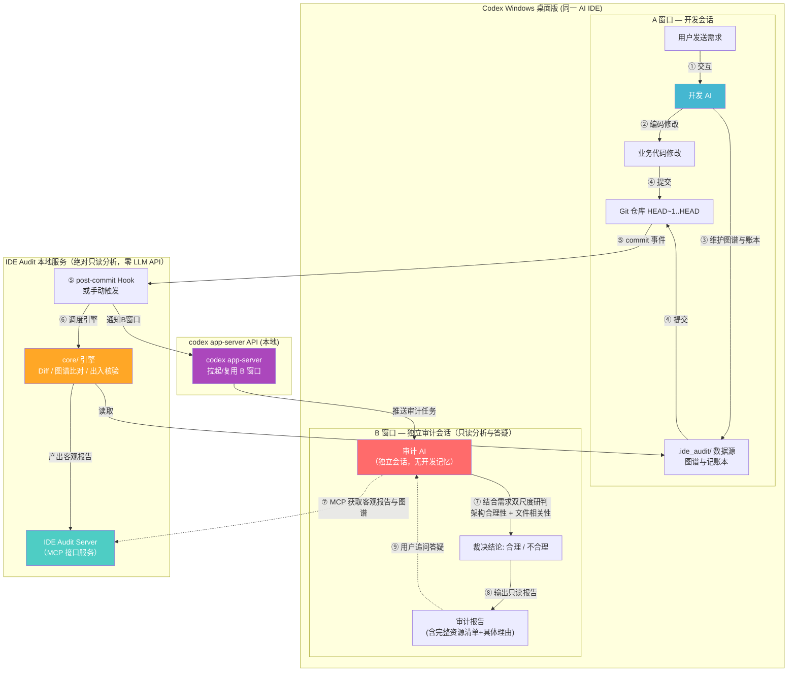
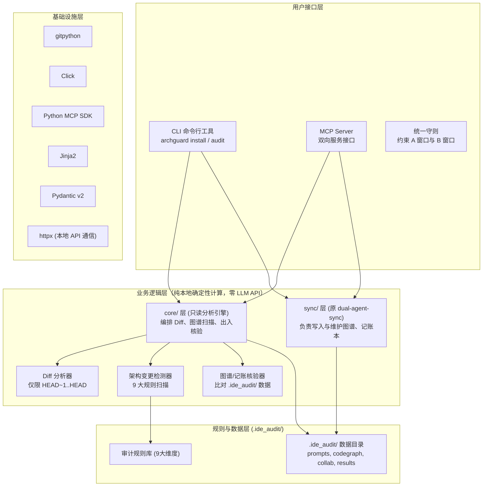
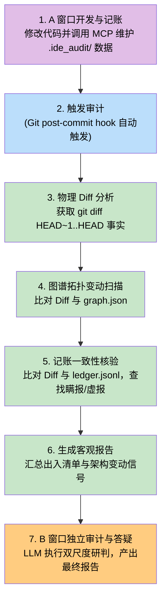

# IDE_Audit 产品设计文档 (V2.0 终局融合版)

## 2026-09-09 用户澄清（当前执行口径）

此节优先于下文原计划中的历史兼容、迁移和归档处理表述。

- 产品验收要求完整替代原 Skill 的逻辑能力，不要求携带或兼容 NEWS 等旧项目的业务历史。事件、诊断纠错、游标、冲突、图谱维护与交接能力仍须验证。
- 旧项目切换单独交付外部脚本与指引；插件不含迁移模块、迁移命令或安装迁移门槛。外部脚本不进入 wheel。NEWS 实际切换及无缝验证属于独立交付，不以资产复制等同于切换完成。
- A 首次接入先建图谱；再次接入先基于已有图谱刷新。初始化或刷新失败，不允许进入编辑流程。后续由 A 动态维护，B/core 仅只读检查封存事实。
- B 已归档时，下次提交创建同桌面项目的新 B，不取消原 B 归档、不自动回放旧消息。仍存在的 B 在重启后优先复用；明确丢失时新建；临时故障不新建。
- 同一工作目录不等于同一 Codex 项目；目前桌面 projectId 绑定尚未实现，是交付阻塞项。

本轮代码：外移迁移模块；A 接入图谱门槛；编辑租约续期；B 归档/丢失精确重建策略。完整增量扫描、跨步骤恢复、同桌面项目 B 和 NEWS 实际切换仍未完成，不宣称全量交付。


> **产品名称**：IDE_Audit
> **设计目标**：构建一个集**代码架构图谱系统、操作协同记账本、物理事实检测与独立双窗口审计**于一体的 AI IDE 架构守护与协同中枢。彻底防止 AI 自作主张修改架构、破坏模块依赖或在修复业务时偷改无关文件。
> **版本**：v2.0（终局融合版）
> **更新时间**：2026-09-04

> **实施状态补充（2026-09-09）**：本文定义终局目标，不代表所有能力已经实现。当前 `0.3.0a1` 已完成审计修复和基础真实 Codex 闭环验证；完成度与剩余验收门以 `HANDOVER.md`、`DEVELOPMENT_PLAN.md` 和 `DUAL_SYNC_PARITY.md` 为准。

> **B 形态补充**：A 在 NEWS 项目开发时，B 必须是 NEWS 项目下的独立审计会话，并可自动打开；仅 cwd 相同或出现在全局任务列表不满足要求。正常重启优先恢复原 B 及历史；原会话确实不存在时可重建空白 B，不默认重放已删除聊天。参见 `B_SESSION_POLICY.md`。

---

## 📝 V2.0 版本更新日志 (Changelog)

### 1. 核心战略升级：全面内生整合 dual-agent-sync，下线原独立 Skill
- **原状态（V1.0）**：将 `dual-agent-sync` 作为外部依赖，假定用户在项目中独立安装该 Skill；IDE_Audit 仅被动读取其产物。
- **现状态（V2.0）**：**IDE_Audit 完全内生吞并整合 `dual-agent-sync` 的全部底层能力**（代码架构图谱 AST 解析与增量维护、操作协同记账本标准读写、多会话游标追踪、并发排他锁控制）。
- **终局目标**：完成后**彻底废弃并下线独立的 `dual-agent-sync` skill**。开发者只需安装 `IDE_Audit` 这一个插件，即可获得原 Skill 的全部协同图谱能力 + IDE_Audit 的独立架构审计能力。

### 2. 核心架构澄清：100% 纯本地运行，零外部 LLM API
- **绝不调用任何商业 LLM API**：IDE_Audit 本地服务（引擎、MCP Server、图谱分析器、记账校验器）均为 100% 纯 Python 本地确定性进程，不发任何网络 AI 请求，无需配置任何 OpenAI/Claude/Anthropic API Key。
- **智能大脑归位**：所有的智能理解、业务编码与审计研判，全部由用户正在使用的 **Codex 桌面版自带的 AI（A 窗口开发，B 窗口独立审计）** 承担。

### 3. 两阶段工作准则彻底定稿
- **阶段一（IDE_Audit 确定性物理与图谱分析）**：
  - 输入最高权重 Git Diff（`HEAD~1..HEAD`）+ 代码图谱（`.ide_audit/codegraph/graph.json`）+ 记账本（`.ide_audit/collab/ledger.jsonl`）；
  - 确定性扫描：架构层/模型层「是否有变更」及依赖拓扑破坏；
  - **记账一致性出入核验**：纯数学计算 Diff 与记账本的出入清单（未声明偷改、虚报、行号范围偏差）；
  - **绝对只读**，不作任何主观越权或合理性推断。
- **阶段二（B 窗口独立审计会话，双尺度裁决与交互答疑）**：
  - 继承阶段一客观分析报告、用户原始需求、代码图谱与记账申报；
  - **双尺度研判**：① 宏观研判架构变更合理性；② 微观研判**修改文件强相关性（铁律：即使架构变更有理，改了无关文件也判定为不合理！）**；
  - **交互答疑与只读约束**：插件绝无代码写权限；审计报告输出后会话保持存活，支持用户在 B 窗口持续追问答疑。

---

## 一、项目基本信息

| 项目 | 说明 |
|:---|:---|
| **产品名称** | IDE_Audit（内置 dual-agent-sync 全部能力） |
| **开源仓库** | https://github.com/lndlwh2024/AI_IDE_Audit |
| **工作目录** | `H:\AIcode\Antigravity\AI_IDE_Audit` |
| **首个适配** | **Codex Windows 桌面版**（ChatGPT desktop app，Powered by Codex & OWL） |
| **技术栈** | Python 3.11+, pip + pyproject.toml, Click, MCP SDK, gitpython, Jinja2, Pydantic, httpx, pytest |
| **外部 LLM 依赖** | **零依赖**（不调用任何第三方大模型 API，无需任何 API Key） |
| **开源协议** | MIT |

---

## 二、双系统融合架构：内生整合 dual-agent-sync

### 2.1 融合设计原理

原 `dual-agent-sync` 作为纯提示词（Skill），其致命缺陷在于靠大模型的“自觉性”维护数据，极易发生格式错乱、遗漏记账或并发锁失效。
IDE_Audit 将其全部核心逻辑下沉为**本地 Python 确定性服务**：

```text
┌─────────────────────────────────────────────────────────────────────────────┐
│                            IDE_Audit 一体化系统架构                          │
├──────────────────────────────────────┬──────────────────────────────────────┤
│  【原 dual-agent-sync 吞并整合层】   │        【IDE_Audit 核心审计层】      │
│                                      │                                      │
│  1. 架构图谱内核 (archguard.sync.graph)│  1. 物理事实解析 (core.diff_analyzer)│
│     · AST 静态语法树全库解析与拓扑生成│     · 严格限定 HEAD~1..HEAD 真实改动 │
│     · 增量更新与依赖调用边提取        │  2. 规则检测引擎 (core.arch_detector)│
│  2. 操作记账内核 (archguard.sync.ledger│     · 9 大架构/模型特征维度扫描      │
│     · 标准化记录改动文件、行号与目的 │  3. 记账出入核验 (core.ledger_check) │
│     · 严格校验格式，绑定 commit 快照 │     · 纯集合运算检测偷渡改动与虚报   │
│  3. 协同锁内核 (archguard.sync.lock) │  4. 会话管理 (adapters.codex.session)│
│     · Python 物理排他锁与会话游标管理│     · 自动拉起/复用 Codex 独立 B 窗口│
│  4. 统一 A 窗口 Skill 守则           │  5. 审计研判与答疑 (B 窗口 LLM 驱动) │
│     · 指导 AI 标准调工具记账与自动 commit│     · 双尺度研判（架构合理+文件相关）│
└──────────────────────────────────────┴──────────────────────────────────────┘
```

### 2.2 原 Skill 下线与平滑过渡
1. **单一安装**：用户只需执行 `archguard install`，即在项目中初始化 `.ide_audit/` 图谱记账模板、部署 Git Hook 并注册本地 MCP Server。
2. **单一规范**：在 `AGENTS.md` 中只注入一个由 IDE_Audit 提供的统一开发守则，**彻底移除原 `dual-agent-sync` skill**。
3. **数据统一**：全面采用 `.ide_audit/` 目录结构（存放 `codegraph/graph.json` 与 `collab/ledger.jsonl`），实现所有运行时数据统一归拢。

### 2.3 核心组件协同关系

| 组件名称 | 表现形式 | 核心职责 | 本架构中的具体动作 |
|:---|:---|:---|:---|
| **IDE_Audit（核心产品）** | Python 包与 CLI 命令行工具 | **总控中枢与规则引擎** | 编排 Diff 解析、加载图谱拓扑、核验记账一致性、生成客观报告。 |
| **archguard.sync 内核** | `sync/` 模块下的本地服务 | **架构图谱与操作记账维护** | 维护全工程文件级依赖图谱与操作记录，数据存放在 `.ide_audit/` 下。 |
| **Skill（行为规范）** | 注入到 `AGENTS.md` 的指令 | **AI 员工守则** | 约束 A 窗口：记录 prompt、调用 MCP 工具维护图谱/记账，改完代码**必自动执行 `git commit`**。 |
| **MCP（工具通信服务）** | IDE Audit Server | **双向通信接口** | 为 A 窗口提供记账写入口；为 B 窗口提供客观事实包与图谱查询等**只读**接口。 |
| **Git Hook（引信）** | 本地 `post-commit` 脚本 | **自动化触发器** | 监听 commit 事件，自动触发分析引擎执行，并唤醒/复用 B 窗口审计会话。 |

### 2.4 sync/ 与 core/ 的边界声明
- **`sync/` 模块**：负责**数据写入与维护**，目标是 100% 继承原 dual-agent-sync 的功能，包括图谱和协同记账本。当前自动 AST 解析覆盖 Python，其他语言关系和语义通过统一工具人工声明；完整等价需按原始能力基线验收。它是开发阶段 A 窗口的操作支撑层。
- **`core/` 模块**：负责**只读分析与扫描**，包括 Diff 提取、比对图谱变化、核验记账一致性。它是审计阶段的核心引擎，绝对不修改任何源码和图谱数据。
两者互不干扰，但同属于一个 `IDE_Audit` 进程，共享本地数据目录。

### 2.5 如何保证 AI IDE 在代码修改后一定执行 `git commit`？
1. **Skill 行为约束**：安装时向 `AGENTS.md` 注入统一守则，完成后只暂存本轮授权文件，调用 `prepare_audit_commit` 或 `archguard prepare`，再自动提交。不允许擅自将其他工作区改动一并暂存；提示词约束本身不等于技术上保证 AI 一定执行。
2. **Git Hook 自动感知**：安装成功且 Hook 未被跳过时，提交触发 `audit --notify`。网络、认证、证据缺失或服务失败应明确报告，不能保证所有情况下成功裁决。
3. **CLI 手工兜底机制**：`archguard commit -m "xxx" <本轮路径>` 完成指定路径暂存、封存与提交；未提供路径时只使用已有暂存区。`archguard audit` 对最后一次 commit 做本地分析，`archguard audit --notify` 请求独立 B 裁决。

### 2.6 为什么不让开发 AI 自审
| 对比维度 | 同窗口自审 | 双窗口独立审计（本方案） |
|:---|:---|:---|
| **独立性** | ❌ 差——开发 AI 审计自己，倾向自我辩护与掩盖越权 | ✅ 强——审计 AI 无开发记忆，纯中立视角 |
| **客观证据** | ❌ 无物理交叉比对，易被自身推导误导 | ✅ 强——基于物理 Diff + 图谱拓扑 + 记账出入硬核比对 |
| **LLM 配置** | 无需额外配置 | 无需额外配置（同一个 AI IDE 驱动两个独立窗口） |
| **用户体验** | 审计混在开发对话流水账中，容易被淹没 | 审计在独立窗口，结构化呈现且支持持续追问 |

---

## 三、技术架构

### 3.1 系统架构总览



### 3.2 技术栈架构图



### 3.3 技术栈表

| 组件 | 技术选择 | 版本 | 理由 |
|:---|:---|:---|:---|
| 语言 | **Python** | 3.11+ | LLM/MCP 生态最成熟，社区最大 |
| 验证与序列化 | **Pydantic** | v2 | 强类型数据验证，性能大幅提升 |
| 包管理 | **pip + pyproject.toml** | — | Python 标准打包方式 |
| CLI 框架 | **Click** | 8.x | 最成熟的 Python CLI 框架 |
| MCP SDK | **Python MCP SDK** | latest | 标准 MCP 协议实现 |
| Git 操作 | **gitpython** | 3.x | 成熟稳定的 Git Python 库 |
| 报告模板 | **Jinja2** | 3.x | 最成熟的 Python 模板引擎 |
| 规则定义 | **YAML** | — | 灵活可扩展，易于维护 |
| 测试 | **pytest** | 8.x | Python 测试标准 |
| HTTP 客户端 | **httpx** | latest | 与本地 codex app-server 通信 |

---

## 四、IDE_Audit 服务说明

### 4.1 什么是 IDE_Audit 服务
IDE_Audit 服务是本插件的**核心后台组件**，它包含数据维护（`sync/`）和审计引擎（`core/`），并提供**本地运行的 MCP Server 进程**。

| 问题 | 回答 |
|:---|:---|
| 它是什么？ | 一个 Python 进程，负责数据协同与客观审计引擎计算。 |
| 在哪里运行？ | **本地**，在用户的电脑上。 |
| 怎么启动？ | Codex 桌面版自动管理（STDIO 模式）或通过 CLI 触发。 |
| 需要联网吗？ | ❌ 不需要，所有分析都在本地完成。 |
| 需要配置 LLM API Key 吗？ | ❌ 不需要，它是**零 LLM API 调用**的物理确定性计算引擎。 |
| 具备代码写权限吗？ | `sync/` 层仅更新图谱和记账本，`core/` 层**绝对只读**，绝无业务代码写权限。 |

### 4.2 安装方式
**一次安装，全部搞定**：
```bash
pip install ide-audit
cd /path/to/your-project
archguard install --ide codex-desktop
```
`archguard install` 一条命令自动完成：
- ✅ 注册 MCP Server 到 Codex 配置
- ✅ 注入统一 Skill 到项目 `AGENTS.md`
- ✅ 安装 `post-commit` git hook
- ✅ 初始化统一的 `.ide_audit/` 图谱与记账本数据目录

---

## 五、系统双窗口分工与两阶段工作准则

### 5.1 核心架构流程

```text
┌────────────────────────────────────────────────────────────────────────┐
│                   Codex Windows 桌面版（同一 AI IDE）                    │
│                                                                        │
│   ┌──────────────────────────┐          ┌──────────────────────────┐   │
│   │   A 窗口（开发会话）     │          │   B 窗口（独立审计会话） │   │
│   │                          │          │                          │   │
│   │  · 用户日常业务交互开发  │          │  · 独立审计员视角        │   │
│   │  · 调 MCP 工具记账与更新 │          │  · 接收阶段一客观事实包  │   │
│   │  · 编码完成自动 git commit│          │  · 执行双尺度综合裁决    │   │
│   │                          │          │  · 纯只读分析，持续答疑  │   │
│   └─────────────┬────────────┘          └─────────────▲────────────┘   │
│                 │                                     │                │
│                 │      跨会话物理隔离（防止自我辩护） │                │
│                 └───────────────── ╳ ─────────────────┘                │
│                                                                        │
│       共用 Codex 自带底层模型（无需配置任何外部 API Key）               │
│       B 窗口通过 codex app-server API 自动拉起/复用                    │
└────────────────────────────────────────────────────────────────────────┘
```

### 5.2 阶段一：IDE_Audit 本地分析阶段（物理事实 + 确定性计算，绝对只读）
* **输入**：Git Diff（`HEAD~1..HEAD`）、代码图谱（`.ide_audit/codegraph/graph.json`）、记账本（`.ide_audit/collab/ledger.jsonl`）。
* **计算与比提示**：
  1. 架构/模型层变更扫描：对比 Diff 与图谱拓扑，检测非法依赖或模块边界破坏。
  2. 记账一致性出入核验：计算 Diff 与记账本的出入清单（瞒报/偷渡越权、虚报、范围偏差）。
* **唯一客观输出**：【架构变更与记账出入客观分析报告】。**绝对只读**，不作主观推断。

### 5.3 阶段二：B 窗口独立审计阶段（LLM 综合裁决，绝对只读，交互答疑）
* **输入**：阶段一报告、用户原始需求、全局代码图谱、记账申报记录。
* **LLM 双尺度核心研判**：
  1. **宏观尺度（架构层）**：架构变动是否在用户原始需求授权范围内？
  2. **微观尺度（文件强相关性铁律）**：**即使架构变更合理，但只要 A 窗口顺带修改了不相关的业务文件，整体结论也必须判定为【不合理】！**
  3. **诚信度核验**：重点审判未声明文件是否为隐蔽偷改。
* **权限与交互约束**：纯只读分析，报告输出后 B 窗口会话保持存活，持续答疑。

### 5.4 完整审计流程（7 步闭环流程）



| 步骤 | 阶段划分 | 操作方 | 核心动作说明 |
|:---:|:---|:---|:---|
| **1** | A 窗口开发 | 用户 & 开发 AI | 交互开发，AI 调用工具更新图谱和记账本，最后自动 `git commit`。 |
| **2** | 审计触发 | Git Hook / CLI | 监听到 commit 事件，拉起本地 `core/` 分析引擎。 |
| **3** | 物理 Diff 分析 | `core/` 引擎 | 解析 `HEAD~1..HEAD` 获取绝对物理变更事实。 |
| **4** | 图谱拓扑扫描 | `core/` 引擎 | 比对 Diff 和架构图谱，检测模块边界是否被破坏。 |
| **5** | 记账一致性核验 | `core/` 引擎 | 用集合运算比对实际 Diff 和记账声明，输出“瞒报”或“虚报”清单。 |
| **6** | 客观报告汇总 | `core/` 引擎 | 将所有物理事实汇总写入 `results/latest.json`，供 MCP 只读读取。 |
| **7** | B 窗口双尺度裁决 | 审计 AI (B 窗口) | B 窗口被本地服务唤醒，读取报告，执行“架构合理性+文件相关性”判定并答疑。 |

---

## 六、审计窗口会话管理

### 6.1 会话策略
| 场景 | 行为 | 技术实现 |
|:---|:---|:---|
| **首次审计** | 创建 B 窗口审计会话 | `codex app-server` → `thread/start` → 获取 `threadId` → 保存到 `.ide_audit/session.json` |
| **后续 commit** | **复用同一个 B 窗口**，发送新任务 | 读取 `threadId` → `thread/resume` → `turn/start` 发送审计消息 |
| **IDE 重启后** | 尝试恢复，失败则新建 | 尝试 `thread/resume`，若失败则重新 `thread/start` |

### 6.2 B 窗口会话复用流程
```text
第一次 commit:
  创建 Audit B 窗口 -> 获得 threadId = abc123 -> 保存到 .ide_audit/session.json

第二次 commit:
  读取 abc123 -> thread/resume -> 发送本次 git diff 与客观报告 -> 在原窗口输出审计报告 #2

Codex 桌面版重启后:
  尝试 thread/resume abc123
  若成功 -> 继续复用；若失败 -> 新建 thread/start -> 获得新 threadId
```

### 6.3 为什么复用 B 窗口
1. **避免窗口爆炸**：频繁 commit 不会打开大量冗余窗口。
2. **历史可追溯**：同一个审计会话中可以看到历次审计报告的对比上下文。
3. **用户体验**：用户始终在同一个固定的 B 窗口查看并追问审计结果。

### 6.4 审计报告持久化
审计报告与客观分析结果均会通过本地文件持久化保存：
- 分析包保存在 `.ide_audit/results/latest.json`。
- 可通过 `archguard history` 命令随时回溯历史。

---

## 七、审计裁决判定矩阵表

| 场景 | 架构/模型层变更 | 变更文件与需求相关性 | 记账与Diff一致性 | B 窗口综合裁决结论 | 报告输出与理由要求 |
|:---:|:---:|:---:|:---:|:---:|:---|
| **1** | 无架构变更 | 所有变更文件均与需求强相关 | 记账与实际一致 | ✅ **合理** | 输出变更清单、通过原因及各文件对需求的支撑说明 |
| **2** | **检测到架构变更**（如重构模块/加表） | **需求明确授权该架构重构**，且修改文件强相关 | 记账准确声明了架构变动 | ✅ **合理** | 输出架构变更资源清单，列出符合需求的证据与图谱影响分析 |
| **3** | **架构变更合理**（需求允许） | **改动了无关业务文件**（如顺手偷改了隔壁模块） | 无论记账是否提及 | ❌ **不合理** | **精确指出无关文件的具体越权修改**，阐明其脱节理由 |
| **4** | **非预期架构变更**（如仅要求打日志却改了表） | — | — | ❌ **不合理** | 标出未授权架构信号与破坏性风险，列出越权清单 |
| **5** | — | — | **存在严重瞒报**（Diff改了核心代码但记账完全隐瞒） | ❌ **不合理** | 重点标出记账出入信息，揭露存在未经声明的暗度陈仓行为 |

---

## 八、九大维度架构检测规则库

IDE_Audit 的 `core/` 引擎内置以下固定扫描规则，所有触发信号均作为客观事实输出：

| 检测维度 | 检测信号 | 严重级别 |
|:---|:---|:---:|
| **文件/目录结构变更** | 新增/删除/移动目录、核心模块文件重命名 | 🔴 高 |
| **数据库 Schema 变更** | migration 文件新增、ALTER/CREATE/DROP | 🔴 高 |
| **API/接口变更** | 路由定义增删、核心函数签名变更 | 🔴 高 |
| **模块合并/拆分** | 多模块代码合并到单文件，或核心模块被反向拆分 | 🔴 高 |
| **安全边界变更** | 认证/授权逻辑修改、密钥处理变更 | 🔴 高 |
| **执行模型变更** | 并发模型、调度机制、消息队列变更 | 🔴 高 |
| **模块依赖边界变更** | import 关系跨越已定义模块边界（基于图谱分析） | 🟠 中 |
| **配置/环境变更** | 环境变量、构建配置、部署配置修改 | 🟠 中 |
| **共享契约变更** | 全局类型定义、接口定义、共享常量修改 | 🟠 中 |

---

## 九、MCP Server 统一工具设计

IDE Audit Server 暴露给 AI 助手的工具集遵循**职责分离与严格只读（对业务代码）原则**：

### 1. 面向 A 窗口（协同与记账工具，调用 `sync/` 层）
- **`record_prompt`**：记录用户原始需求（追加写入 `.ide_audit/prompts/pending.json`）。
- **`record_sync_event`**：标准化记录开发操作事件到 `.ide_audit/collab/ledger.jsonl`，本地自动进行数据格式校验。
- **`sync_graph`**：增量更新代码架构图谱 `.ide_audit/codegraph/graph.json`。

### 2. 面向 B 窗口（只读审计与答疑工具，调用 `core/` 层）
- **`audit_changes`**：获取阶段一客观分析报告包（包含 Diff 物理事实、架构/模型变更信号、记账一致性出入清单、全部 Prompt）。
- **`get_architecture_graph`**：只读查询项目的模块划分、文件职责（`purpose`）与依赖调用拓扑。
- **`get_ledger_records`**：只读查询 A 窗口的记账申报记录，用于辅助比对。
- **`get_file_diff`**：只读获取特定争议文件的具体代码增删行差异片段，用于核验细节或深入答疑。

---

## 十、目录结构与数据资产分布

```text
H:\AIcode\Antigravity\AI_IDE_Audit\
├── archguard/                         # Python 包核心代码
│   ├── __init__.py
│   ├── core/                          # 核心审计引擎（确定性物理层，只读分析）
│   │   ├── __init__.py
│   │   ├── engine.py                  # 审计主引擎
│   │   ├── diff_analyzer.py           # Git Diff 解析器
│   │   ├── architecture_detector.py   # 9 大维度规则扫描器
│   │   ├── graph_analyzer.py          # 图谱拓扑比颠器
│   │   ├── ledger_analyzer.py         # 记账出入核验器
│   │   ├── prompt_store.py            # Prompt 存储与归档管理
│   │   └── report_generator.py        # 客观事实报告生成器
│   │
│   ├── sync/                          # 【内生整合的数据维护层】
│   │   ├── __init__.py
│   │   ├── graph.py                   # 图谱生成、AST 依赖提取与维护
│   │   ├── ledger.py                  # 记账本标准读写与数据校验
│   │   └── lock.py                    # 并发排他锁与游标管理
│   │
│   ├── rules/                         # 规则定义 (Pydantic v2 模型 + YAML)
│   ├── mcp/                           # MCP Server 实现（STDIO 服务端入口）
│   ├── adapters/                      # IDE 适配层
│   │   ├── codex/                     # Codex 桌面版适配 (会话复用、Prompt模板)
│   │   └── git_hook.py                # post-commit 自动引信管理
│   │
│   ├── cli/                           # CLI 命令行工具 (archguard)
│   └── config/                        # 路径配置与目录管理
│
├── templates/                         # Jinja2 模板文件
├── tests/                             # 自动化测试套件
├── docs/
│   ├── PRODUCT_DESIGN_V1.0.md         # 历史设计文档
│   └── PRODUCT_DESIGN_V2.0.md         # 本文档
├── pyproject.toml
└── README.md
```

### 运行时统一数据目录 (`.ide_audit/`)
所有的运行时数据均被统一归拢至用户项目的 `.ide_audit/` 目录下，彻底废弃原 `.ai-sync/`：
- **`codegraph/graph.json`**：全局架构拓扑（`sync/` 维护，`core/` 读取）
- **`collab/ledger.jsonl`**：操作记账本（`sync/` 维护，`core/` 读取）
- **`prompts/pending.json`**：当前两次 commit 间暂存的原始需求
- **`results/latest.json`**：最近一次客观分析报告数据包
- **`session.json`**：B 窗口 threadId 持久化记录

---

## 十一、四阶段实施规划（吞并整合与发版下线）

### 阶段一：核心物理审计引擎（✅ 已完成，v0.1.0 已发布）
- Git Diff 解析器、9 大规则扫描器、Prompt 存储归档、客观报告生成器与审计主引擎；
- 27 个单元测试 100% 通过，已推送到 GitHub 仓库。

### 阶段二：CodeGraph 与记账内核原生化整合（🚀 当前阶段）
1. **原生图谱引擎（`archguard/sync/graph.py` 与 `core/graph_analyzer.py`）**：
   - 实现全项目 AST 语法树依赖扫描与图谱生成；
   - 实现 Diff 引入依赖与现有图谱拓扑的比对分析。
2. **原生记账与出入核验（`archguard/sync/ledger.py` 与 `core/ledger_analyzer.py`）**：
   - 实现记账本结构化校验读写；
   - 实现 Git Diff 实际改动与记账本声明范围的数学集合比对，精确输出未声明修改、虚报与范围偏差清单。
3. **升级主引擎（`core/engine.py`）**：
   - 输出包含【物理事实 + 图谱拓扑变动 + 记账出入清单】的标准化客观报告。
4. **单元测试集**：编写图谱分析与出入核验自动化测试。

### 阶段三：只读 MCP Server + Codex 双窗口适配 + 原 Skill 下线
1. **实现统一 MCP Server（`archguard/mcp/server.py`）**：
   - 暴露 A 窗口记账图谱工具 + B 窗口只读审计工具。
2. **Codex 桌面版适配（`adapters/codex/`）**：
   - 实现 B 窗口独立会话拉起、持久复用与 turn 消息推送。
3. **注入一体化开发守则，正式下线原 Skill**：
   - 产出统一的 A 窗口 Skill 规范（包含协同记账、图谱联动与改动后自动 commit）；
   - 用户工程全面**废弃并下线原 `dual-agent-sync` skill**。

### 阶段四：CLI 工具链、全场景集成测试与正式交付
1. **`archguard` CLI 命令矩阵**：`install`（一条命令全自动初始化）、`audit`、`commit`、`graph`、`history`。
2. **全场景真实联调验证**：
   - 验证架构重构放行、偷改无关文件精准拦截、未声明瞒报精准拦截、B 窗口持续交互答疑。
3. **生产打包与正式发布**。
